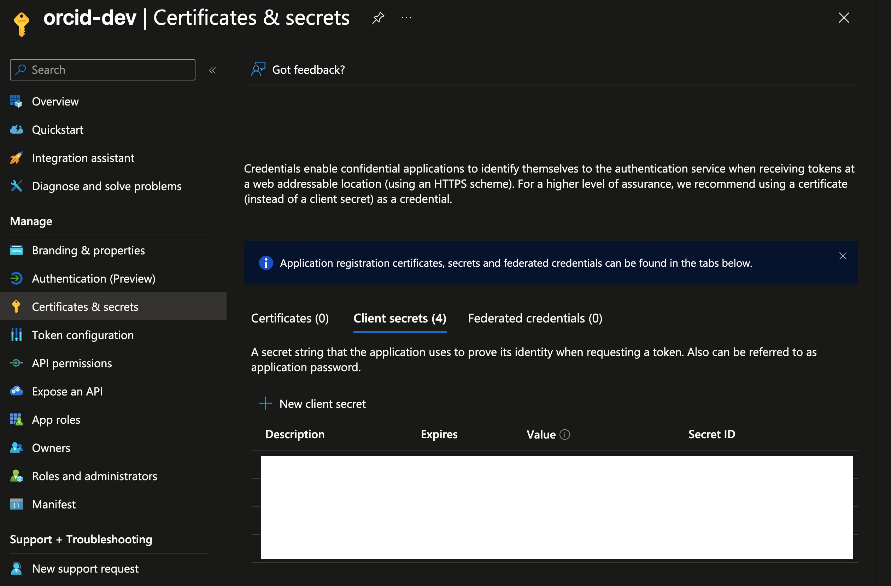
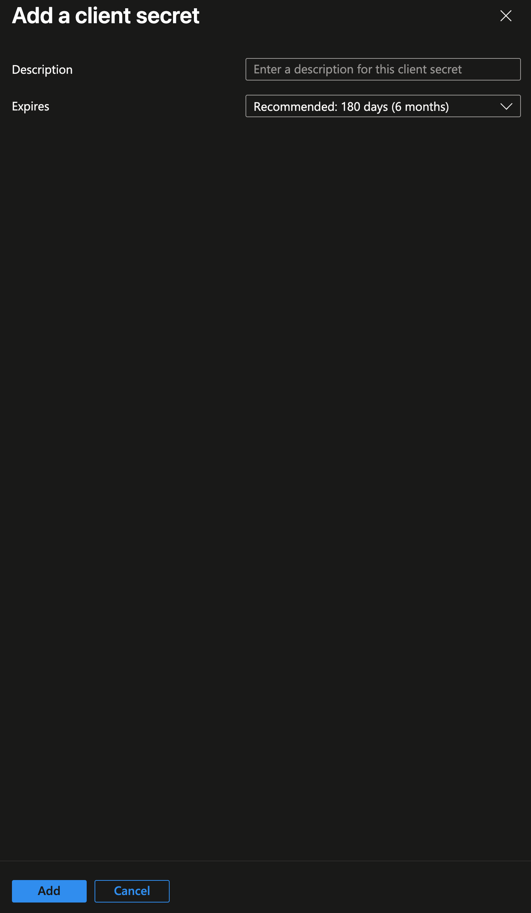

# RDSS Best Practice for Managing Client Secrets

## What is a client secret?

A client secret is a confidential credential used in OAuth 2.0 and similar authentication/authorization flows to verify the identity of an application (the "client") when it communicates with an authorization server or API.

For PUL we will be using Client Secrets in production for [EntraID](https://github.com/pulibrary/pul-it-handbook/blob/main/services/entra-id.md). Some of the documentation for EntraID says not to do this and instead to use certificates. We know that but our Operations team have suggested to use Client Secrets, at least for now.

We do have a way of rotating client secrets to mitigate the issue in the event the secret gets leaked.

- Client ID — a public identifier for the app, similar to a username. It's not secret and can be exposed in code or URLs (your app's username).

- Client secret — a private string, similar to a password, that only the application (and the authorization server) should know (your app's password).

## Why do they matter?

Client secrets stops random people or malicious software from pretending to be your application.

- They protect access to data and systems.
- They enable trust between systems without a human involved.

## Where should the client secrets be stored?

Secrets should be rotated periodically and stored in secure vaults. Secure vault process for RDSS Team TBD.

## What happens if a client secret gets leaked?

If a client secret leaks, anyone with it can potentially authenticate as your application until it's revoked or rotated.

### To revoke or rotate a token

- Login to EntraID and delete the client secret that already exists to invalidate it
- Create a new client secret and store it in lastpass and ansible vaults for ORCID
- Run the playbook to update the app_vars on the servers that the key was leaked

## How do we register a client secret for EntraID?

- Click on `Certificates & secrets` in the Entra dashboard menu
- Click on `New Client Secret`

- Enter a description for the new client secret using `Description`
- Select an expiration date for the new client secret (the default is `180 days (6 months)`)
- Submit by clicking `Add`

  

_Please note that the current documentation can be found at Step 5 of [the pulibrary/pul-it-handbook Entra ID documentation](https://github.com/pulibrary/pul-it-handbook/blob/main/services/entra-id.md)._

## Registered Applications

| Application                                                 | Entra URL                                                                                                                                                                     |
| ----------------------------------------------------------- | ----------------------------------------------------------------------------------------------------------------------------------------------------------------------------- |
| PSR (Hosted by 4Science) (Not Yet Available for Production) | [psr-repo-test](https://entra.microsoft.com/#view/Microsoft_AAD_RegisteredApps/ApplicationMenuBlade/~/Credentials/appId/34882666-6159-4f31-817a-c4d6d5278f68/isMSAApp~/false) |
