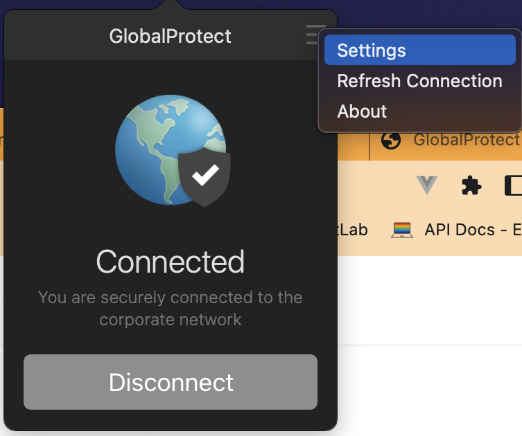
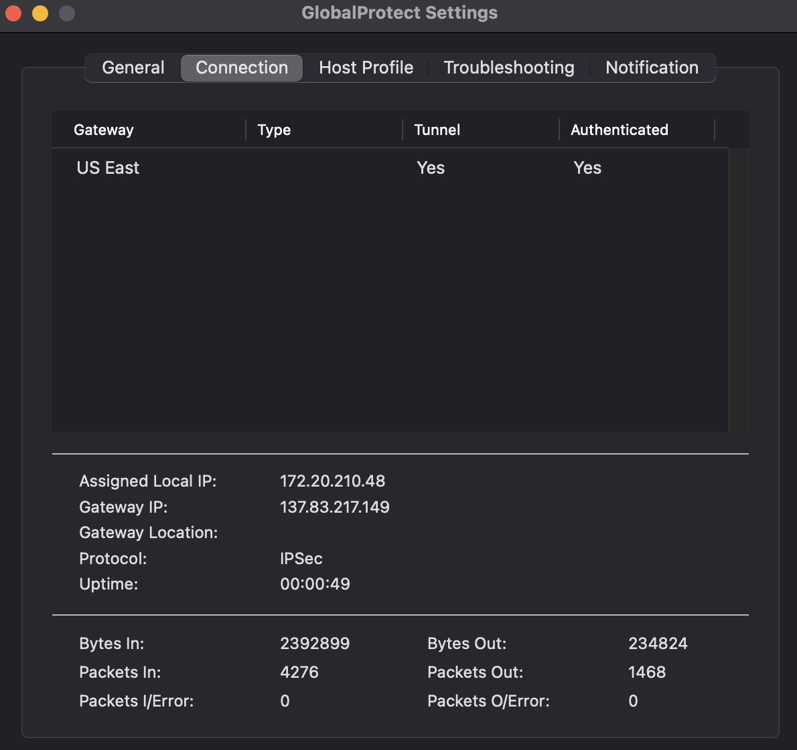

# Google Cloud Platform (GCP)

The Google Cloud Platform is currently used by RDSS and Operations in order to support deployments of the following services:

- DataSpace
- Open Access Repository (OAR)
- ProQuest File Storage and Transfer

The network segments for these are partitioned in order to align with the architectural patterns followed by those servers utilized within the Princeton University Library network:

| Host                     | Description                                                                                   |
| ------------------------ | --------------------------------------------------------------------------------------------- |
| `gcp-dataspace-dev1`     | `development` deployment environment for DataSpace                                            |
| `gcp-dataspace-staging1` | `staging` deployment environment for DataSpace                                                |
| `gcp-dataspace-prod1`    | `production` deployment environment for DataSpace                                             |
| `gcp-oar-dev1`           | `development` deployment environment for the OAR                                              |
| `gcp-oar-staging1`       | `staging` deployment environment for the OAR                                                  |
| `gcp-oar-prod1`          | `production` deployment environment for the OAR                                               |
| `proquestdrop1`          | SFTP server used for transferring MARC-8 files from ProQuest to colleagues within the Library |

### Bastion Hosts

In order to access these, one must connect using a bastion proxy host. There exists three of these, one for each deployment environment:

| Host                        |
| --------------------------- |
| `pul-gcdc-bastion-dev1`     |
| `pul-gcdc-staging-bastion1` |
| `pul-gcdc-prod-bastion1`    |

### Load Balancer Hosts

Finally, there also exist load balancer hosts for each network segment:

| Host                   |
| ---------------------- |
| `pul-gcdc-adc`         |
| `pul-gcdc-staging-adc` |
| `pul-gcdc-prod-adc`    |

### Accessing Hosts Over SSH

Firstly, in order to have access to any of the hosts, one must use the GlobalProtect client to access the Princeton virtual private network (VPN): https://princeton.service-now.com/service?id=kb_article&sys_id=KB0012373

In order to use `ssh` to access any of these hosts, one must invoke `ssh` in the following manner:

```bash
$ ssh -J pulsys@$BASTION_HOST pulsys@$GCP_HOST
```

...where `$BASTION_HOST` is the fully-qualified domain name or IP address of the bastion proxy host, and `$GCP_HOST` is the FQDN or IP address of the GCP host. For example, in order to access `gcp-oar-dev1`, one must invoke the following:

```bash
$ ssh -J pulsys@pul-gcdc-bastion-dev1 pulsys@gcp-oar-dev1
```

#### Troubleshooting Access Difficulties

There are times at which one may need to adjust the firewall settings for one of the bastion hosts. This typically manifests in an error resembling the following:

```bash
$ ssh -J pulsys@$BASTION_HOST pulsys@$GCP_HOST
ssh: connect to host $BASTION_HOST port 22: Operation timed out
```

One must first access one of the three VPC networks:

| VPC Network        |
| ------------------ |
| `pul-gcdc-dev`     |
| `pul-gcdc-staging` |
| `pul-gcdc-prod`    |

...which will then allow one to access one of the following associated firewall rules:

| Firewall Rules               |
| ---------------------------- |
| `pul-gcdc-dev-allow-ssh`     |
| `pul-gcdc-staging-allow-ssh` |
| `pul-gcdc-prod-allow-ssh`    |

Here, one must please add an IP address range to the `Source filters`. The address is found within the `Gateway IP` entry for the GlobalProtect, and one formats this using the CIDR syntax (e. g. `192.168.1.1/32`). Please see the following screenshot for a visual reference:




Should further difficulties be encountered, please seek support from the `#infrastructure` Channel on the [Princeton University Library Slack](https://pulibrary.slack.com).
