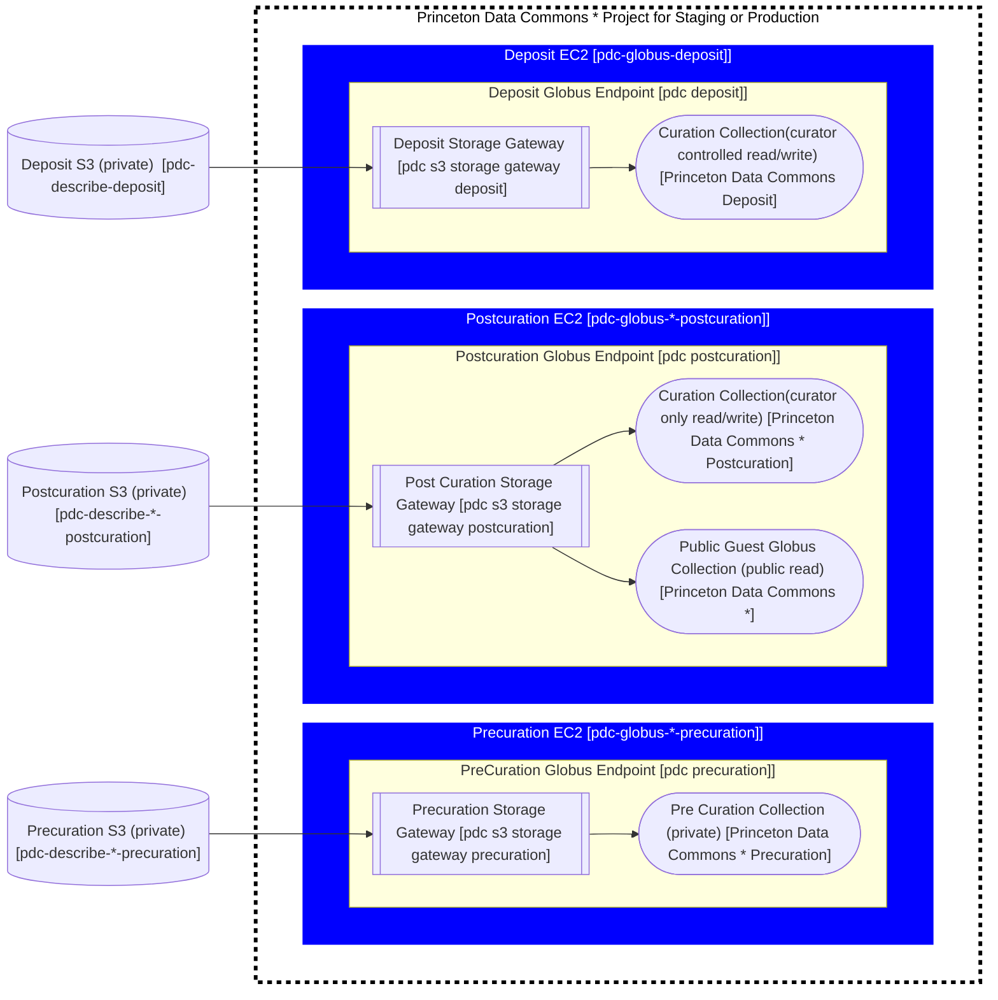

# Globus

[Globus](https://www.globus.org/data-transfer) is a fast, reliable file transfer service that makes it easy for users to move data between two GridFTP servers or between a GridFTP server and a user's machine (Windows, Mac or Linux). It is increasingly used by researchers to transfer large data sets because it provides faster and more reliable transfers than previous methods.

For a quick intro to Globus take a look at [Globus for newbies](https://docs.google.com/document/d/1d8u3KhsoX-x3k59GgWfhC7325R6616j8RytccTelPWM/edit#).

## Historic Globus Setup

There are currently two EC2 Servers serving up the exact samne globus structure. Need to find out why that is...
Current Globus collections for dataspace

#### Endpoint

There is a single globus enpoint: `Princeton Data Repository Endpoint`

#### Storage gateways

There are currently four storage gateways:

- Princeton DSS Gateway - S3 Gateway `dss-server-data3` (defunct)
- Princeton Dataspace Posix Gateway - POSIX Gateway (defunct)
- Princeton Dataspace s3 Gateway - S3 Gateway `prds-globus`
- Princeton Research Data Dataspace Gateway - S3 Gateway `prds-dataspace`

#### Collections

There are currently six collections:

- another_test | fkayiwa@princeton.edu | guest | Princeton Research Data Dataspace Gateway
- Princeton University Library Data and Statistical Services | fkayiwa@princeton.edu | mapped | Princeton DSS Gateway
- Princeton Dataspace Collection | fkayiwa@princeton.edu | mapped | Princeton Research Data Dataspace Gateway
- Princeton Dataspace Posix Collection | fkayiwa@princeton.edu | mapped | Princeton Dataspace Posix Gateway
- Princeton Research Data Repository | mjc12@princeton.edu | guest | Princeton Research Data Dataspace Gateway
- CG | fkayiwa@princeton.edu | guest | Princeton Research Data Dataspace Gateway

**Note:** There seem to be collections for PDC, DSS, Dataspace and the POSIX collection. We should figure out what these collections are all for...

## Monitoring
Our globus endpoints are being monitored by [Honey Badger](https://app.honeybadger.io/projects/103564/sites)
Additional sites can be configured for monitoring by adding the sites `GCS Manager URL` to honey badger.

### Determining the `GCS Manager URL`
You must be on VPN to ssh onto the Globus EC2 instances
1. To access the aws console first got to https://princeton.edu/aws and log in
1. Access the [EC2 instances](https://us-east-1.console.aws.amazon.com/ec2/home?region=us-east-1#Instances:search=:pdc;v=3;$case=tags:true%5C,client:false;$regex=tags:false%5C,client:false) to view the public IP address for the endpoint you would like to monitor
1. SSH onto the EC2 instance by runnning `pulsys@<public ip address>`
1. On the EC2 server run `globus-connect-server endpoint show`.  This will display the `GCS Manager URL`

## Adding a new URL to Honey Badger
A new URL once it is determined via the steps above can be added to Honey Badger by:
1. visiting [Honey Badger](https://app.honeybadger.io/projects/103564/sites)
1. click `Add uptime check`
1. fill in the Name appropriately for the endpoint
1. fill in the url with `<GCS Manager URL>/api/info`
1. Choose `Page includes string` from match type
1. Fill in Match with `"code":"success"`
1. Click Save Changes

## Princeton Data Commons (PDC) Globus Setup

Our globus setup consists of four globus collections connected to three s3 buckets on two globus endpoints.

We are creating a separate Endpoint and EC2 instance to make sure that Upload does not impact download/ deposit and vice versa. We also believe this might scale better into the future.



Pre Curation collections should be private (Not show up in the collections search on globus)
Postcuration guest collection - Should be public

- There should be two globus endpoints for each environment (staging & prod) and a deposit endpoint

  - staging
    - pdc precuration
    - pdc postcuration
  - prod
    - pdc precuration
    - pdc postcuration
  - pdc deposit

- The globus endpoints should exist on five separate EC2 instances
  - staging
    - pdc-globus-staging-precuration
    - pdc-globus-staging-postcuration
  - prod
    - pdc-globus-prod-precuration
    - pdc-globus-prod-postcuration
  - deposit
    - pdc-globus-deposit
- There will be two s3 buckets for each environment and a deposit bucket
  - staging
    - pdc-describe-staging-precuration
    - pdc-describe-staging-postcuration
  - prod
    - pdc-describe-prod-precuration
    - pdc-describe-prod-postcuration
  - deposit
    - pdc-describe-deposit
- Each bucket will have a storage gateway attached to the correct globus endpoint
  - staging
    - pdc s3 storage gateway precuration
    - pdc s3 storage gateway postcuration
  - prod
    - pdc s3 storage gateway precuration
    - pdc s3 storage gateway postcuration
  - deposit
    - pdc s3 storage gateway deposit
- Each storage gateway will have a mapped collection

  - staging
    - Princeton Data Commons Staging Precuration
    - Princeton Data Commons Staging Postcuration
  - prod
    - Princeton Data Commons Precuration
    - Princeton Data Commons Postcuration
  - deposit
    - Princeton Data Commons Deposit

- Each Mapped post-curation collection will have a guest collection attached to the corresponding mapped collection.   This will give public read access to the post-curated data in Globus.
  - staging
    - Princeton Data Commons Staging
  - prod
    - Princeton Data Commons

## Data management

### pre-curation

Our Pre-Curation Globus instance is for research data that has not yet gone through curation. It should have a DOI that matches the draft one created by PDC Describe.

Our legacy Globus instance does not have the concept of pre curated data sets.

### post-curation

Our Globus post curation instance is for research data that has gone through curation. Because
it has gone through curation, it will always have a [DOI](https://www.doi.org/), and it is organized under its DOI number.

Data is stored in S3 buckets. We are in the process of building a new Globus production system. (Project plan [here](https://docs.google.com/document/d/13HkbOoC7OLD70FIEwFlHs8zi2Z8h53Puflm7DCcjnSw/edit).)

Our legacy Globus instance has its data in an S3 bucket called `prds-dataspace`.
Our new PDC branded globus instance will have its data in a bucket called `pdc-globus-prod`.

## Account setup

In order to help maintain our Globus infrastructure you'll need an AWS account with the right permission. See the [onboarding](onboarding.md) documentation for how to set that up.

## Contacting Globus for support
  To contact globus for support either email them (SUPPORT@GLOBUS.ORG), or contact them via their [Help Page](https://app.globus.org/help)

  When using the Help page click "Check Support Ticket Status". You'll need to create an account on their support system (zendesk). You can submit tickets and keep track of them via this option. You can also include attachments. Try to request that Francis is added to the thread when you submit a support ticket.

## Configuring Globus

### Prequisites

- To build an ami please install the prequisites from https://github.com/pulibrary/vm-builds#prerequisite-software
  - The following steps require awscli which should be installed as part of vm-builds
- You will be utilizing [princeton-ansible](https://github.com/pulibrary/princeton_ansible#macos). Please make sure the environment is set up on your local machine

### Global Setup

This section documents steps that were taken to setup items that will be utilized in the following sections like the service account and the Amazon Machine Instance (AMI). They do not need to be run to set up each Globus Endpoint

#### Creating the service account (Not needed each time)

1. Fill in the ticket in [service now](https://princeton.service-now.com/service?id=sc_cat_item&sys_id=f44539ab4ff81640f56c0ad14210c77c)

   - Duration: Permanent
   - Type: General
   - Service Account User(s): Team members should be added here

1. after the account is set up a password must be selected and stored in lastpass

1. Duo will be enabled and the first person to enable it will always get extraneous duo (Just ignore duo for the service account unless asked)
1. Other folks will follow https://princeton.service-now.com/service?id=kb_article&sys_id=575eff5387064dd012ae43bd0ebb35b0#section5 to add their device to duo. Make sure to name the device with your name.

#### Creating the ami (Not needed each time)

1.  run `packer build aws-globus.pkr.hcl` from the [vm-buids](https://github.com/pulibrary/vm-builds) directory on your local machine
1.  see your new ami in [AWS](https://us-east-1.console.aws.amazon.com/ec2/v2/home?region=us-east-1#Images:visibility=owned-by-me)

#### Setting up a Globus Project

**Note** This section is untested

1. Go to [developers.globus.org](https://developers.globus.org), sign in as rdss-globus
   **TODO** does rdss-globus have this ability??
1. Click on `Register a new Globus Connect Server v5`
1. Click `Add another project`

### Making a new S3 bucket

To make a new S3 bucket with a copy of the PDC Globus data:

1. To access the aws console first got to https://princeton.edu/aws and log in
1. Then access https://s3.console.aws.amazon.com/s3/buckets?region=us-east-1# for the s3 buckets
1. Click create new bucket
1. Name the bucket
   For PDC describe the name should be one of the five choices below:
   - pdc-describe-staging-precuration
   - pdc-describe-staging-postcuration
   - pdc-describe-prod-precuration
   - pdc-describe-prod-postcuration
   - pdc-describe-deposit
1. Under `Copy settings from existing bucket` choose `pdc-describe-staging-precuration` (assumes it has been set up)
1. Under `Object Ownership` choose enable ACLs
1. click `Create Bucket`
1. click `Properties` tab on the bucket you just created
1. Enable Versions
   1. click on the Edit button to the far right of `Bucket Versioning` section
   1. choose `Enable` and click on `Save`
   1. click `Management` tab
   1. click on `Create lifecycle rule`
   1. Fill in `Remove old deleted versions` for the name
   1. choose `Apply to all objects in the bucket`
   1. check `I acknowledge...`
   1. check `Permanently delete noncurrent versions of objects`
   1. check `Delete expired object delete markers or incomplete multipart uploads`
   1. Fill in 30 (14 for deposit) in `Days after objects become noncurrent`
   1. check `Delete expired object delete markers`
   1. check `Delete incomplete multipart uploads`
   1. Fill in 14 in `Number of days`
   1. Click on `Create Rule`
1. (Optionally) Copy the data using the aws cli: `aws s3 sync s3://prds-dataspace s3://pdc-globus-prod`

   **Note:** that the copy will take about five hours.

### Enabling SHA-256 checksums automatically on upload
1. Download https://github.com/pulibrary/pdc_describe/blob/main/s3-checksum.yaml to your local machine OR if you have PDC Describe cloned to your machine use it there.
1. Visit [princeton.edu/aws](princeton.edu/aws) to login to AWS
1. then visit the [AWS Stacks](https://us-east-1.console.aws.amazon.com/cloudformation/home?region=us-east-1#/stacks?filteringText=&filteringStatus=active&viewNested=true)
1. Click on `Create Stack` and choose `with new resources` from the drop down
1. Choose `Upload a template file` and select the file from step 1
1. Click `Next`
1. Specify a name like `prod-precuration-sha-256-checksum` which includes the name of the bucket this stack will apply to
1. Specify the bucket  for example: `pdc-describe-prod-precuration`
1. Click `Next`
1. Leave defaults in place on the next page and click `Next`
1. Acknowledge that this gives the stack access to the data 
1. Click Submit
1. Wait until you see `CREATE_COMPLETE` in the events tab
1. Click on the Resources tab
1. Click on the link next to ChecksumLambdaRole (which will open a new window)
1. Click on "Add Permission" and select "Create inline policy"
1. Choose S3 from the Service section
1. Click `All S3 actions (s3:*)` in the Actions section
1. Choose s3 bucket in the resources and put in your bucket name
1. Click `Review Policy` at the bottom
1. Fill in `Allow-S3-Access` in the Name
1. Click on `Create Policy`
1. Close the window that was opened
1. In the Stack Window on your new Stack Click on the Resources tab and make note of the Physical ID of the `ChecksumLambdaFunction` (You will need it below) For example `sha-256-checksum-precuratio-ChecksumLambdaFunction-IsK4yDcshh1C`
1. Go to your bucket (specified above)
1. Click on properties (https://s3.console.aws.amazon.com/s3/buckets/pdc-describe-staging-precuration?region=us-east-1&tab=properties)
1. Scroll down to Event Notifications and click `Create event notification`
1. Fill in event name with `Create SHA256 on Upload`
1. Choose `All object create events` under `Event Types`
1. Under `Destination choose` `Lambda function`
1. fill in the lambda function Physical ID you just created ex `sha-256-checksum-precuratio-ChecksumLambdaFunction-IsK4yDcshh1C` and sleect the arn
1. Test the lambda by uploading a file to the bucket


### Creating the AWS EC2 instance from AMI

1. In princeton-ansible check the group_vars/globus/common.yml to make sure the image_id matches the ami you either created or are using
1. Run the playbook with either staging (default) or production (`-e runtime_env=production`). For example the command below will create a staging EC2 instance named pdc-globus-staging

   ```
   ansible-playbook playbooks/aws_ec2.yml -e ec2_name=<name>
   ```

   <name> should be one of the following:

   - pdc-globus-staging-precuration
   - pdc-globus-staging-postcuration
   - pdc-globus-prod-precuration
   - pdc-globus-prod-postcuration

1. To access the aws console first go to [AWS login](https://princeton.edu/aws)
1. See your new instance in [AWS](https://us-east-1.console.aws.amazon.com/ec2/v2/home?region=us-east-1#Instances:instanceState=running) Note the IP address you will need it to configure Globus in following steps
1. Create the [Elastic IP](https://github.com/pulibrary/pul-it-handbook/blob/main/services/aws.md)

### Configure Globus Connect Server

To register a Globus Endpoint do the following:

1. Go to [developers.globus.org](https://developers.globus.org), sign in as rdssglobus
1. Add a new Globus Connect Server and fill out the form in the **Princeton Data Commmons Production** or **Princeton Data Commmons Staging** Projects.
   1. Type in the new name
      The name should be one of the following:
      - PDC Precuration
      - PDC Postcuration
   1. click Register Globus Connect Server
1. Generate a client secret. Be ready to save the value off, you will only see it once.
   1. Click Generate a New Client Secret within the new section on the website created by the step above
   1. Fill in the description of the secret (can be anything)
   1. Click Save
   1. **Save the Client ID and Client Secret values in a note in "Shared-ITMS-Passwords" in Lastpass** (They are needed in the next step)
1. Log into the virtual machine and configure globus:

   1. `ssh pulsys@<public IP>`
   1. On the server set the endpoint name you utilized above and generated client id. This will allow a copy and paste of the commands in the next step to work without editing
      ```bash
      export endpoint_name=<name from above (include staging or production)>
      export client_id=<client id from above step>
      ```
   1. On the server run

      ```bash
      mkdir app_config
      cd app_config
      globus-connect-server endpoint setup "$endpoint_name"  --organization "Princeton University Library" --client-id $client_id --owner rdssglobus@princeton.edu --contact-email lsupport@princeton.edu
      ```

      1. you will be prompted for the client secret
      1. Accept Let's Encrypt ToS
      1. It will then run for some time (10 minutes about) and then give you a URL to paste into a browser
         You will get a response close to this

         ```bash
         Please authenticate with Globus to set the owner of the endpoint:
         ----------------------------------------------------------------
         https://auth.globus.org/v2/oauth2/authorize?client_id=auuid-&redirect_uri=https%3A%2F%2Fauth.globus.org%2Fv2%2Fweb%2Fauth-code&...
         ----------------------------------------------------------------
         ```

         1. Paste the results from your browser to complete endpoint creation. Utilize the browser where you logged into Globus as rdssglobus for this step

         1. click on the link rddglobus@princeton.edu on the page and it will create a code

      1. paste the above code in on the command line
      1. It will then finish giving you a url for google cloud storage
      1. This will also create a `deployment-key.json` file in the `app_config` directory. This is an important file that connects the localhost to the globus web network

### Configure Globus Node

1. `ssh pulsys@<public IP>`
1. On the server set the endpoint name you utilized above and generated client id. This will allow a copy and paste of the commands in the next step to work without editing
   ```bash
   cd app_config
   export endpoint_name=<name from above (include staging or production)>
   export client_id=<client id from above step>
   ```
1. run the following command to configure your node: (note: use of `sudo`) You will be prompted for the client secret you saved in lastpass.

   ```bash
   sudo globus-connect-server node setup \
      --client-id $client_id
   sudo systemctl restart apache2
   ```

1. Finish the setup by running this on the VM

   ```bash
   sudo globus-connect-server login localhost
   ```

   **NOTE:** Depending on the browser you paste the url into, you will be logged in as that person. If you put it into an incognito and login with rdssglobus you will be rdssglobus. If you use a browser that you are logged into then you will be logged into the connect server as yourself. If you receive messages like `None of your identities have been granted a role to access this resource` you may need to get administrator access for your account, or login as rdssglobus instead.

### Register the Endpoint with OIT

**This is a manual step.**

1.  ssh onto the EC2 instance `ssh pulsys@<public IP>`
1.  run `sudo globus-connect-server endpoint show`
1.  email ` pglobus@princeton.edu` with subject `Register Globus Endpoint`

    ```
    Hello,

    Can you please register the following Princeton Research Data Globus endpoint to be managed by Research Computing's Globus account:

    <copy and paste from step 1>
    We will be connecting this endpoint to an S3 bucket.

    Thank you!

    -- <your name>
       Princeton University Library

    ```

### Register all admin users on the endpoint

1. go to [Globus Endpoints](https://app.globus.org/console/endpoints) and sign in as rdssglobus (see last pass)
1. click on New endpoint you created above
1. click on the `Roles` tab and Continue for Authentication Consent

   1. you may need to add the aws key here
      1. In princeton_ansible directory on your local machine, see the aws key information needed
         `ansible-vault view group_vars/globus/vault.yml`

1. Add administrators via the command line `ssh pulsys@<public IP>` and run
   ```
   sudo globus-connect-server endpoint role create administrator rdssglobus@princeton.edu
   sudo globus-connect-server endpoint role create administrator cac9@princeton.edu
   sudo globus-connect-server endpoint role create administrator fkayiwa@princeton.edu
   sudo globus-connect-server endpoint role create administrator bs3097@princeton.edu
   sudo globus-connect-server endpoint role create administrator hc8719@princeton.edu
   sudo globus-connect-server endpoint role create administrator jrg5@princeton.edu
   sudo globus-connect-server endpoint role create administrator kl37@princeton.edu
   ```

### Troubleshooting staging VM that reboots with new IP

1. After rebooting the VM take note of the new AWS provided IP. Retrieve the UUID with the following.
   1. login following the prompts
      ```
      globus-connect-server login localhost
      ```
   1. see the node UUID
      ```
      globus-connect-server node list --use-explicit-host localhost
      ```
1. Update your Nodes (IP)s
   ```
   globus-connect-server node update ${yourNodesUUID} -i ${yourNewIP} --use-explicit-host localhost
   ```

### Connect globus endpoint to S3 bucket
Utilize the `rdssglobus` AWS IAM user by logging in in as rdssglobus in an incognito window. Login information is in lastpass.

1.  login to globus
    `sudo globus-connect-server login localhost`

    - paste the url in to your browser
      **NOTE:** Depending on the browser you paste the url into, you will be logged in as that person. If you put it into an incognito and login with rdssglobus you will be rdssglobus. If you use a browser that you are logged into then you will be logged into the connect server as yourself. If you receive messages like `None of your identities have been granted a role to access this resource` you may need to get administrator access for your account, or login as rdssglobus instead.

1.  Put the bucket name and gateway in a variable. Choose one of the following:

    - pdc-describe-staging-precuration
    - pdc-describe-staging-postcuration
    - pdc-describe-prod-precuration
    - pdc-describe-prod-postcuration
    - pdc-describe-deposit

    ```
    export bucket_name=<bucket name>
    ```

1.  Put the gateway name in a variable. Choose one of the following

    - pdc s3 storage gateway precuration
    - pdc s3 storage gateway postcuration
    - pdc s3 storage gateway precuration
    - pdc s3 storage gateway postcuration
    - pdc s3 storage gateway deposit

    ```
    export gateway_name=<gateway name>
    ```

1.  Add the S3 bucket as

    ```
    sudo globus-connect-server storage-gateway create s3   "$gateway_name" --domain princeton.edu --s3-endpoint https://s3.amazonaws.com --s3-user-credential --bucket $bucket_name
    ```

    **Note** the id returned by this command, you will need it in the following

    1. Assign the gateway id to a variable
       ```
       export gateway_id=<output from above command>
       ```

### Create a mapped Collection for access to the S3 bucket

1.  Create a collection for the bucket

    - Utilize one of the following for the `<name>`:
      - Princeton Data Commons Staging Precuration
      - Princeton Data Commons Staging Postcuration
      - Princeton Data Commons Precuration
      - Princeton Data Commons Postcuration
      - Princeton Data Commons Deposit
        `export collection_name=<name>`
    - Utilize one of the following for the `<info link>`
      - https://pdc-describe-staging.princeton.edu/about
      - https://pdc-describe.princeton.edu/about
        `export info_link=<info link>`
    - Utilize one of the following for the `<description>`
    - if this is a staging system add `--user-message "Staging data! Please do not store production data here"`

      ```
      sudo globus-connect-server collection create $gateway_id / "$collection_name"  --organization 'princeton.edu' --contact-email prds@princeton.edu --info-link $info_link --description "$collection_name Globus Collection for curators" --keywords princeton.edu,RDOS,research  --allow-guest-collections  --enable-https
      ```

      **Note** the id returned by this command, you will need it in the next step

1.  Assign the collection id to a variable
    ```
    export collection_id=<output from above command>
    ```
1.  Add administrators via the command line
    ```
    sudo globus-connect-server collection role create $collection_id administrator rdssglobus@princeton.edu
    sudo globus-connect-server collection role create $collection_id administrator cac9@princeton.edu
    sudo globus-connect-server collection role create $collection_id administrator fkayiwa@princeton.edu
    sudo globus-connect-server collection role create $collection_id administrator bs3097@princeton.edu
    sudo globus-connect-server collection role create $collection_id administrator hc8719@princeton.edu
    sudo globus-connect-server collection role create $collection_id administrator jrg5@princeton.edu
    sudo globus-connect-server collection role create $collection_id administrator kl37@princeton.edu
    ```
1.  In princeton_ansible directory on your local machine, see the aws key information needed
    `ansible-vault view group_vars/globus/vault.yml`

1.  visit the collection on https://app.globus.org/collections?scope=administered-by-me
    1. Click on the credentials tab and click continue to setup the credentials for accessing s3 (utilize the IAM key from above)

### Create a guest Collection for public access to the mapped collection

Guest collections are public and readonly, we use them for the general public to be able to download the data.

** this is a manual step **
Choose one of the following for the name:

- Princeton Data Commons Staging
- Princeton Data Commons

1.  visit https://app.globus.org/collections?scope=administered-by-me
1.  click on the collection you just created
1.  click on the collections tab
1.  click on "Add a guest Collection"
    - You may need to authorize (click rdssglobus@princeton.edu and allow)
1.  click browse and select the S3 bucket top path
    1.  Select folder `pdc-describe-staging-postcuration` for stating
    1.  Select folder `pdc-describe-prod-postcuration` for production
1.  Fill in the name and description
1.  Click create collection
1.  Click "Add Permissions - Share With"
1.  Choose "Public"
1.  Click Add Permissions

### Create a group for Curator Access

1.  visit https://app.globus.org (and login as rdssglobus)
1.  click on "Groups" on the left hand side
1.  click on "Create New Group" on the left hand side
1.  Type in "Princeton Curators" for the group name
1.  For each Curator invote them into the group

### Add the Curator Group as a manager of all the collections

  - Utilize one of the following for the `<name>`:
    - Princeton Data Commons Staging Precuration
    - Princeton Data Commons Staging Postcuration
    - Princeton Data Commons Precuration
    - Princeton Data Commons Postcuration
 1. visit https://app.globus.org (and login as rdssglobus)
 1. Find the collection you need to update in Collections
 1. Click on the Roles Tab
 1. Click on "Assign new Role"
   1. Choose Group
   1. Enter "Princeton Curators"
   1. Choose "Administrator"
   1. Click "Add Role"

### Certificate Authority Updates

1. We have a [Globus Certs Playbook](https://github.com/pulibrary/princeton_ansible/blob/main/playbooks/globus_certs.yml) set up to automatically update the certificates for Globus VMs. Run this Playbook.
2. When completed check the `/var/lib/globus-connect-server/grid-security/certificates` to see if old certificates still exist.

For **[ca-update-2022](https://docs.globus.org/ca-update-2022/)** the following files should be removed if the playbook fails to remove them

```
7a42187f.* 4b828555.* c7ab88a4.* globus_transfer_ca_2.* globus_transfer_ca_2_int.*
```
### Rotating the client secret key
1. visit [developers.globus.org](https://auth.globus.org/v2/web/developers) (and login as rdssglobus)
   1. click on the endpoint you would like to rotate the client secret for
   1. click on `Generate new Client Secret`
   1. copy the client secret to last pass or somewhere safe
1. ssh onto the EC2 instance `ssh pulsys@<public IP>`
   1. run `sudo globus-connect-server node set-configuration client_secret`
   1. enter the new client secret when prompted
   1. `sudo systemctl restart gcs_manager_assistant`
   1. `sudo systemctl restart gcs_manager`
   1. `globus-connect-server endpoint show` (should now work, you may need to login)
1. go back to [developers.globus.org](https://auth.globus.org/v2/web/developers) (and login as rdssglobus if not already logged in)
   1. click on the endpoint you just rotated
   1. Delete the client secret that should now be invalidated

### Creating AWS IAM Keys for Curators
1. visit princeton.edu/aws and log in
1. Click on the IAM Unser services
1. Click on the Users on the left hand side
1. Click Add User in the top right
1. Fill in User Name with `pdc-<netid>`
1. Click `Next`
1. Choose `pdc-curator` as the group
1. Click `Next`
1. Fill in `RDOS` & `PDC` as tags
1. Click `Next`
1. find your new user `pdc-<netid>` and click on the name
1. Click on `Security Credentail` tab
1. Click `Create Access Key`
1. Choose `Application running outside AWS`
1. Click `Next`
1. Show Private key and copy contents
1. On a new browser tab, Add an SSH Key to LastPasss
1. Fill in Private Key
1. Grab Public key from AWS tab
1. On LastPass tab fill in private key and name the entry `PDC Globus <curator name> Curator Key`
1. On LastPass tab go to sharing center at the bottom
1. Click the Red Plus to add a shared folder
1. Name it PDC-Globus-<curator-name>
1. Click on Create
1. Click on Manage when hovering over the new Folder
1. Add the curator as an Administrator
1. Click Invite
1. Click Save
1. Contact the Curator to let them know about the key

### Increasing size of Drive

 1. Run the following command to list all volumes with volume id and name below:
    ```bash
    aws ec2 describe-instances --query 'Reservations[*].Instances[*].[Tags[?Key==`Name`].Value,InstanceId,BlockDeviceMappings[*].Ebs.VolumeId]' --output text
    ```
    you will see results with the following:

    ```bash
    i-043b67b2b215d180b
    prds-dataspace-endpoint1
    vol-0c02aca34398ea8e5   vol-0e8522f82fd721b25
    i-03d6cd75ba1fca824
    ...
    ...
    ```

 2. Select the volume you wish to create a snapshot of in the event something goes wrong. Then create a snapshot of it with the following. In my example below I will create a snapshot of `prds-dataspace-endpoint1` with the volume ID `vol-0c02aca34398ea8e5` and instance ID of `i-043b67b2b215d180b`

   ```bash
   aws ec2 create-snapshot --volume-id vol-0c02aca34398ea8e5 --description "This is the prds-dataspace-endpoint root volume snapshot"
   ```

 3. Modify the volume of your instance. We will continue to use the VM in step two. Our goal is to resize it to have 100GB. We do that with the following (this can take a while so grab some :coffee: ):
    ```bash
    aws ec2 modify-volume --volume-type gp2 --size 100 --volume-id vol-0c02aca34398ea8e5
    ```

 1. Check to see if the results if your server has a larger disk size by running the following:

   ```bash
   sudo lsblk
   ```
   You will see results similar to this:
   ```bash
   NAME         MAJ:MIN RM  SIZE RO TYPE MOUNTPOINT
   loop0          7:0    0 24.4M  1 loop /snap/amazon-ssm-agent/6312
   loop1          7:1    0 25.1M  1 loop /snap/amazon-ssm-agent/5656
   loop2          7:2    0 55.6M  1 loop /snap/core18/2714
   loop3          7:3    0 63.3M  1 loop /snap/core20/1852
   loop4          7:4    0 63.3M  1 loop
   loop6          7:6    0 91.9M  1 loop /snap/lxd/24061
   loop7          7:7    0 55.6M  1 loop /snap/core18/2721
   loop8          7:8    0 49.9M  1 loop /snap/snapd/18357
   loop9          7:9    0 91.8M  1 loop /snap/lxd/23991
   loop10         7:10   0 63.3M  1 loop /snap/core20/1828
   loop11         7:11   0 49.9M  1 loop /snap/snapd/18596
   nvme0n1      259:0    0  100G  0 disk
   ├─nvme0n1p1  259:1    0  7.9G  0 part /
   ├─nvme0n1p14 259:2    0    4M  0 part
   └─nvme0n1p15 259:3    0  106M  0 part /boot/efi
   ```
 5. Expand the volume so the Operating System can use it with the following command (note the space between the ones which matter):
   ```bash
   sudo growpart /dev/nvme0n1 1
   ```

  6. You can now delete your snapshot in step 1 if successful.

