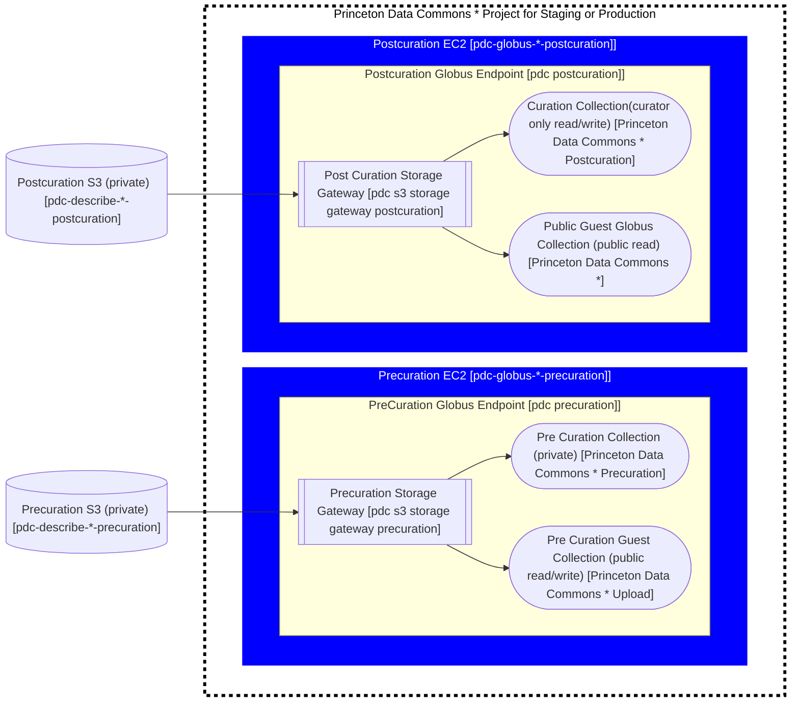

# Globus

[Globus](https://www.globus.org/data-transfer) is a fast, reliable file transfer service that makes it easy for users to move data between two GridFTP servers or between a GridFTP server and a user's machine (Windows, Mac or Linux). It is increasingly used by researchers to transfer large data sets because it provides faster and more reliable transfers than previous methods.

For a quick intro to Globus take a look at [Globus for newbies](https://docs.google.com/document/d/1d8u3KhsoX-x3k59GgWfhC7325R6616j8RytccTelPWM/edit#).

## Current Globus Setup

There are currently two EC2 Servers serving up the exact samne globus structure.  Need to find out why that is...
Current Globus collections for dataspace
#### Endpoint
  There is a single globus enpoint: `Princeton Data Repository Endpoint`
#### Storage gateways
  There are currently four storage gateways:
  * Princeton DSS Gateway - S3 Gateway `dss-server-data3` (defunct)
  * Princeton Dataspace Posix Gateway  - POSIX Gateway - ??? (defunct)
  * Princeton Dataspace s3 Gateway - S3 Gateway `prds-globus`
  * Princeton Research Data Dataspace Gateway - S3 Gateway `prds-dataspace`
#### Collections
  There are currently six collections:
  * another_test                                               | fkayiwa@princeton.edu | guest           | Princeton Research Data Dataspace Gateway
  * Princeton University Library Data and Statistical Services | fkayiwa@princeton.edu | mapped          | Princeton DSS Gateway
  * Princeton Dataspace Collection                             | fkayiwa@princeton.edu | mapped          | Princeton Research Data Dataspace Gateway
  * Princeton Dataspace Posix Collection                       | fkayiwa@princeton.edu | mapped          | Princeton Dataspace Posix Gateway
  * Princeton Research Data Repository                         | mjc12@princeton.edu   | guest           | Princeton Research Data Dataspace Gateway
  * CG                                                         | fkayiwa@princeton.edu | guest           | Princeton Research Data Dataspace Gateway
  
  **Note:** There seem to be collections for PDC, DSS, Dataspace and the POSIX collection.  We should figure out what these collections are all for...

## New Globus Setup

Our globus setup consists of four globus collections connected to two s3 buckets on two globus endpoints.

  We are creating a separate Endpoint and EC2 instance to make sure that Upload does not impact download and vice versa.  We also believe this might scale better into the future.


Pre Curation collections should be private (Not show up in the collections search on globus)
Precurated guest collection - Should be restricted to any researcher 

  * There should be two globus endpoints for each environment (staging & prod)
    * staging
      * pdc precuration
      * pdc postcuration
    * prod
      * pdc precuration
      * pdc postcuration

  * The globus endpoints should exist on two separate EC2 instances
    * staging
      * pdc-globus-staging-precuration
      * pdc-globus-staging-postcuration
    * prod
       * pdc-globus-prod-precuration
       * pdc-globus-prod-postcuration
  * There will be two s3 buckets
    * staging
      * pdc-describe-staging-precuration
      * pdc-describe-staging-postcuration
    * prod
      * pdc-describe-prod-precuration
      * pdc-describe-prod-postcuration
  * Each bucket will have a storage gateway attached to the correct globus endpoint
    * staging
      * pdc s3 storage gateway precuration
      * pdc s3 storage gateway postcuration
    * prod
      * pdc s3 storage gateway precuration
      * pdc s3 storage gateway postcuration
  * Each storage gateway will have a mapped collection
    * staging
      * Princeton Data Commons Staging Precuration
      * Princeton Data Commons Staging Postcuration
    * prod
      * Princeton Data Commons Precuration
      * Princeton Data Commons Postcuration

  * Each Mapped collection will have a guest collection attached to the corresponding mapped collection
    * staging
      * Princeton Data Commons Staging Upload
      * Princeton Data Commons Staging
    * prod
      * Princeton Data Commons Upload
      * Princeton Data Commons


## Data management
### pre-curation
Our Pre-Curation Globus instance is for research data that has not yet gone through curation. It may or may not have a DOI depending on how the data is put into our s3 bucket.

Our legacy Globus instance does not have the concept of pre curated data sets.

### post-curation
Our Globus post curation instance is for research data that has gone through curation. Because 
it has gone through curation, it will always have a [DOI](https://www.doi.org/), and it is organized under its DOI number. 

Data is stored in S3 buckets. We are in the process of building a new Globus production system. (Project plan [here](https://docs.google.com/document/d/13HkbOoC7OLD70FIEwFlHs8zi2Z8h53Puflm7DCcjnSw/edit).)

Our legacy Globus instance has its data in an S3 bucket called `prds-dataspace`.
Our new PDC branded globus instance will have its data in a bucket called `pdc-globus-prod`.

## Account setup
In order to help maintain our Globus infrastructure you'll need an AWS account with the right permission. See the [onboarding](onboarding.md) documentation for how to set that up.

## Configuring Globus

### Prequisites
  * To build an ami please install the prequisites from https://github.com/pulibrary/vm-builds#prerequisite-software
    * The following steps require awscli which should be installed as part of vm-builds
  * You will be utilizing [princeton-ansible](https://github.com/pulibrary/princeton_ansible#macos).  Please make sure the environment is set up on your local machine

### Global Setup 
This section documents steps that were taken to setup items that will be utilized in the following sections like the service account and the Amazon Machine Instance (AMI).  They do not need to be run to set up each Globus Endpoint
#### Creating the service account (Not needed each time)
  1. Fill in the ticket in [service now](https://princeton.service-now.com/service?id=sc_cat_item&sys_id=f44539ab4ff81640f56c0ad14210c77c)
      * Duration: Permanent
      * Type: General
      * Service Account User(s): Team members should be added here

   1. after the account is set up a password must be selected and stored in lastpass

   1. Duo will be enabled and the first person to enable it will always get extraneous duo (Just ignore duo for the service account unless asked)
   1. Other folks will follow https://princeton.service-now.com/service?id=kb_article&sys_id=575eff5387064dd012ae43bd0ebb35b0#section5 to add their device to duo.  Make sure to name the device with your name.

#### Creating the ami (Not needed each time)

 1. run `packer build aws-globus.pkr.hcl` from the [vm-buids](https://github.com/pulibrary/vm-builds) directory on your local machine
 1. see your new ami in [AWS](https://us-east-1.console.aws.amazon.com/ec2/v2/home?region=us-east-1#Images:visibility=owned-by-me)

#### Setting up a Globus Project
  **Note** This section is untested 
1. Go to [developers.globus.org](https://developers.globus.org), sign in as rdss-globus
   **TODO** does rdss-globus have this ability??
1. Click on `Register a new Globus Connect Server v5`
1. Click `Add another project`

### Making a new S3 bucket
To make a new S3 bucket with a copy of the PDC Globus data:
1. To access the aws console first got to https://princeton.edu/aws and log in
1. Then access https://s3.console.aws.amazon.com/s3/buckets?region=us-east-1# for the s3 buckets
1. Click create new bucket
1. Name the bucket
   For PDC describe the name should be one of the four choices below:
   * pdc-globus-staging-precuration
   * pdc-globus-staging-postcuration
   * pdc-globus-prod-precuration
   * pdc-globus-prod-postcuration
1. Under `Copy settings from existing bucket` choose `prds-dataspace` 
1. Under `Object Ownership` choose enable ACLs
1. uncheck `Block all public access` and acknowledge `Turning off block all public access might result in this bucket ...`
1. click `Save`
1. (Optionally) Copy the data using the aws cli: `aws s3 sync s3://prds-dataspace s3://pdc-globus-prod`

    **Note:** that the copy will take about five hours. 

### Creating the AWS EC2 instance from AMI

1. In princeton-ansible check the group_vars/globus/common.yml to make sure the image_id matches the ami you either created or are using
1. Run the playbook with either staging (default) or production (`-e runtime_env=production`).  For example the command below will create a staging EC2 instance named  pdc-globus-staging 
   ```
   ansible-playbook playbooks/aws_ec2.yml -e ec2_name=<name>
   ```
   <name> should be one of the following:
    * pdc-globus-staging-precuration
    * pdc-globus-staging-postcuration
    * pdc-globus-prod-precuration
    * pdc-globus-prod-postcuration

1. See your new instance in [AWS](https://us-east-1.console.aws.amazon.com/ec2/v2/home?region=us-east-1#Instances:instanceState=running)  Note the IP address you will need it to configure Globus in following steps


### Configure Globus Connect Server
To register a Globus Endpoint do the following:
1. Go to [developers.globus.org](https://developers.globus.org), sign in as rdssglobus  
2. Add a new Globus Connect Server and fill out the form in the **Princeton Data Commmons Production** or **Princeton Data Commmons Staging** Projects. 
   1. Type in the new name
      The name should be one of the following:
      * PDC Precuration
      * PDC Postcuration
      * PDC Precuration
      * PDC Postcuration
   1. click Register Globus Connect Server 
3. Generate a client secret.  Be ready to save the value off, you will only see it once.
   1. Click Generate a New Client Secret within the new section on the website created by the step above
   1. Fill in the description of the secret (can be anything)
   1. Click Save
   1. **Save the Client ID and Client Secret values in a note in "Shared-ITMS-Passwords" in Lastpass** (They are needed in the next step) 
4. Log into the virtual machine and configure globus:
   1. `ssh pulsys@<public IP>`
   1. On the server set the endpoint name you utilized above
      ```bash
      export endpoint_name=<name from above>
      ```
   1. On the server run
      ```bash
      mkdir app_config
      cd app_config
      globus-connect-server endpoint setup $endpoint_name  --organization "Princeton University Library" --client-id "<your client id>" --owner rdssglobus@princeton.edu --contact-email lsupport@princeton.edu
      ```
         1. you will be prompted for the client secret
         1. Accept Let's Encrypt ToS
         1. It will then run for some time (10 minutes about) and then give you a URL to paste into a browser
         You will get a response close to this

            ```bash
            Please authenticate with Globus to set the owner of the endpoint:
            ----------------------------------------------------------------
            https://auth.globus.org/v2/oauth2/authorize?client_id=auuid-&redirect_uri=https%3A%2F%2Fauth.globus.org%2Fv2%2Fweb%2Fauth-code&...
            ----------------------------------------------------------------
            ```
            1. Paste the results from your browser to complete endpoint creation. Utilize the browser where you logged into Globus as rdssglobus for this step 

            1. click on the link rddglobus@princeton.edu on the page and it will create a code
         1. paste the above code in on the command line
         1. It will then finish giving you a url for google cloud storage
         1. This will also create a `deployment-key.json` file in the `app_config` directory. This is an important file that connects the localhost to the globus web network

### Configure Globus Node
Still in your VM in the `app_config` directory 
1. run the following command to configure your node: (note: use of `sudo`)

   ```bash
   sudo globus-connect-server node setup \
      --client-id "your client id"
   sudo systemctl restart apache2
   ```
1. Finish the setup by running this on the VM

   ```bash
   sudo globus-connect-server login localhost
   ```
   **NOTE:** Depending on the browser you paste the url into, you will be logged in as that person.  If you put it into an incognito and login with rdssglobus you will be rdssglobus.  If you use a browser that you are logged into then you will be logged into the connect server as yourself.  If you receive messages like `None of your identities have been granted a role to access this resource` you may need to get administrator access for your account, or login as rdssglobus instead. 

### Register the Endpoint with OIT
   **This ia a manual step.**

   1. ssh onto the EC2 instance `ssh pulsys@<public IP>`
   1. run `sudo globus-connect-server endpoint show`
   1. email `tengi@princeton.edu` with subject `Register Globus Endpoint`

      ```
      Hello Chris,

      Can you please register the following Princeton Research Data Globus endpoint to be managed by Research Computing's Globus account:

      <copy and paste from step 1>
      We will be connecting this endpoint to an S3 bucket.

      Thank you!

      -- <your name>
         Princeton University Library

      ```

### Register all admin users on the endpoint
   1. go to [Globus Endpoints](https://app.globus.org/console/endpoints) and sign in as rdssglobus (see last pass)
   1.  click on New endpoint you created above and Continue for Authentication Consent
         1. you will need to add the aws key here

   1. Add administrators via the command line `ssh pulsys@<public IP>` and run
      ```
      sudo globus-connect-server endpoint role create administrator rdssglobus@princeton.edu
      sudo globus-connect-server endpoint role create administrator cac9@princeton.edu
      sudo globus-connect-server endpoint role create administrator fkayiwa@princeton.edu
      sudo globus-connect-server endpoint role create administrator bs3097@princeton.edu
      sudo globus-connect-server endpoint role create administrator hc8719@princeton.edu
      sudo globus-connect-server endpoint role create administrator jrg5@princeton.edu
      sudo globus-connect-server endpoint role create administrator kl37@princeton.edu
      ```


### Connect globus endpoint to S3 bucket

   1. login to globus
      `sudo globus-connect-server login localhost`
         * paste the url in to your browser
      **NOTE:** Depending on the browser you paste the url into, you will be logged in as that person.  If you put it into an incognito and login with rdssglobus you will be rdssglobus.  If you use a browser that you are logged into then you will be logged into the connect server as yourself.  If you receive messages like `None of your identities have been granted a role to access this resource` you may need to get administrator access for your account, or login as rdssglobus instead. 

   1. Add the S3 bucket as 
      ```
      sudo globus-connect-server storage-gateway create s3     "S3 Storage Gateway"     --domain princeton.edu     --s3-endpoint https://s3.amazonaws.com --s3-authenticated    --bucket pdc-globus-staging-precuration
      ```
      **Note** the id returned by this command, you will need it in the following

      1. Assign the gateway id to a variable
         ```
         export gateway_id=<output from above command>
         ```

### Create a mapped Collection for access to the S3 bucket
   1. Create a collection for the bucket
      * Utilize one of the following for the `<name>`:
         * Princeton Data Commons Staging Precuration
         * Princeton Data Commons Staging Postcuration
         * Princeton Data Commons Precuration
         * Princeton Data Commons Postcuration
      * Utilize one of the following for the `<info link>`
         *  https://pdc-describe-staging.princeton.edu/about
         * https://pdc-describe.princeton.edu/about
      * Utilize one of the following for the `<description>`
      * if this is a staging system add `--user-message "Staging data!  Please do not store production data here"`

         ```
         sudo globus-connect-server collection create $gateway_id / <name>  --organization 'princeton.edu' --contact-email prds@princeton.edu --info-link <info link> --description <description> --keywords princeton.edu,RDOS,research  --allow-guest-collections  --enable-https
         ```   
         
         **Note** the id returned by this command, you will need it in the next step

   1. Assign the collection id to a variable
          ```
          export collection_id=<output from above command>
          ```
   1. Add administrators via the command line
            ```
            sudo globus-connect-server collection role create $collection_id administrator rdssglobus@princeton.edu
            sudo globus-connect-server collection role create $collection_id administrator cac9@princeton.edu
            sudo globus-connect-server collection role create $collection_id administrator fkayiwa@princeton.edu
            sudo globus-connect-server collection role create $collection_id administrator bs3097@princeton.edu
            sudo globus-connect-server collection role create $collection_id administrator hc8719@princeton.edu
            sudo globus-connect-server collection role create $collection_id administrator jrg5@princeton.edu
            sudo globus-connect-server collection role create $collection_id administrator kl37@princeton.edu
            ```
         

   1. visit the collection on https://app.globus.org/collections?scope=administered-by-me
      1. setup the credentials for accessing s3 (utilize the IAM key from ` ansible-vault edit group_vars/globus/vault.yml`)


### Create a guest Collection for public access to the mapped collection
  ** this is a manual step **
  Choose one of the following for the name:
   * Princeton Data Commons Staging Upload
   * Princeton Data Commons Staging
   * Princeton Data Commons Upload
   * Princeton Data Commons


   1. visit https://app.globus.org/collections?scope=administered-by-me
   1. click on the collection you just created
   1. click on the collections tab
   1. click on "Add a guest Collection"
   1. click bowse and select the s3 bucket top path
   1. Fill in the name and description
   1. Click create collection
   1. Click "Add Permissions - Share With"
   1. Choose "Public"
   1. Click write if this is an upload collection
   1. Click Add Permissions