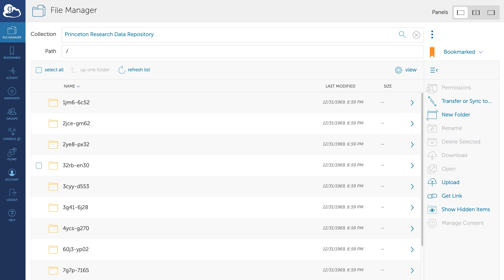
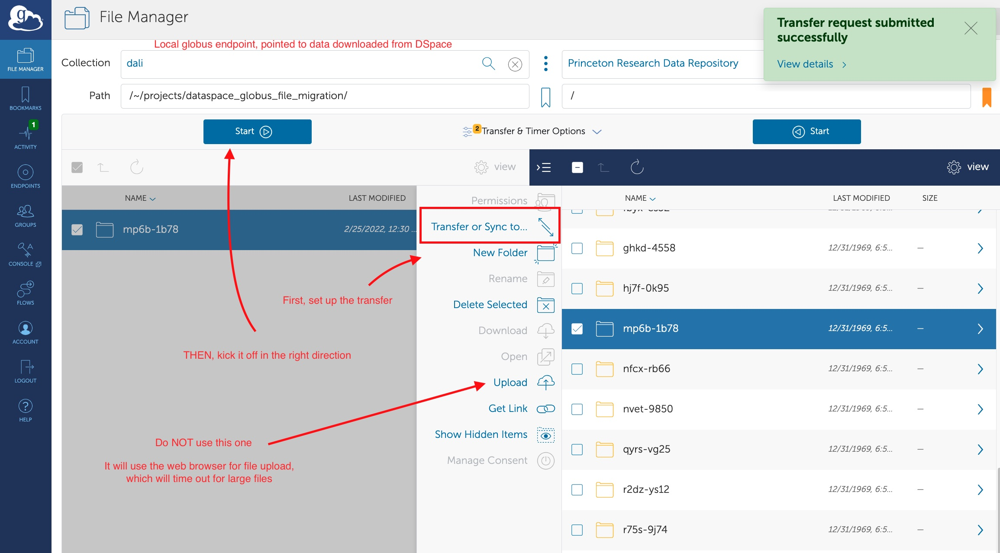

# Globus

[Globus](https://www.globus.org/data-transfer) is a fast, reliable file transfer service that makes it easy for users to move data between two GridFTP servers or between a GridFTP server and a user's machine (Windows, Mac or Linux). It is increasingly used by researchers to transfer large data sets because it provides faster and more reliable transfers than previous methods.

### Moving files from DataSpace to Globus

When datasets have large files to download, we like to make of copy of the data on Globus to make re-use easier. Here is how to do that:

#### 1. Get the software and an account
Download and install [Globus connect personal](https://www.globus.org/globus-connect-personal). Create yourself a globus account using your Princeton credentials. Set up a local globus end point. Ask Matt Chandler to give you write access to the Princeton Research Data Repository endpoint on Globus.

#### 2. Find the data in the PRDS spreadsheet

PRDS maintains [a spreadsheet](https://docs.google.com/spreadsheets/d/1etA_6llJT_H8F_Pe5UmtyP7cXRlUdiBvEqtIBgrYY2A/edit#gid=0) of data sets to be transferred. Look there to find the one you want to transfer. It needs to have a handle and a folder name (which is based on a DOI).

#### 4. Find the data in DataSpace and download the files

Using the handle from the spreadsheet, find the item in DataSpace. Make a local folder using the folder name (DOI) from the spreadsheet. Download all the files for that object to that folder. 

**NOTE:** Some of these files are very large and will take a long time to download. If you try to kick them all off at once they might crash your browser or bring your local network to its knees. You might want to kick these off as you leave for the day and let them run overnight.

#### 5. Transfer the data to Globus

In the [Globus web app](https://app.globus.org/file-manager), select the double panel view:

In the left panel, find the data your downloaded via your local globus endpoint.

In the right panel, find the folder with the same DOI name in globus. To do this, search for "Princeton Research Data Repository." You might want to bookmark it so you can find it again easily. 

Select the local folder you want to sync with the folder on Globus. From the left panel, use the "Transfer or Sync to..." button to choose the parameters of your upload. For example, you can choose to only upload files that haven't been uploaded before, or only files that have changed. After configuring the sync, use the "Start" button on the left to start the data transfer. This will transfer the data via the Globus GridFTP protocol, instead of using your browser for file transfer.

#### 6. Ask PRDS to check that it uploaded correctly

Once the upload is complete, check that the files in DataSpace match the files in Globus. Then, inform the #research_data_management channel on slack and ask someone from PRDS to verify the upload. Give them a link to the ticket and ask them to indicate in the ticket that it has been checked. Once it has been checked and deemed correct, the ticket can be closed. 
