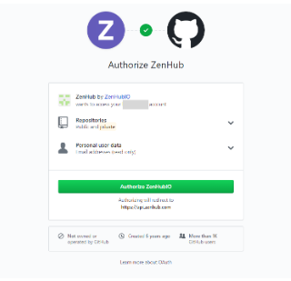

# RDSS Onboarding

When a new staff member joins RDSS here are some tasks that need to happen for them to have the right access:

1. On their development machine, confirm that the user account has admin access, and that [homebrew](https://brew.sh/) can be installed. (Laptops configured by PUL will typically give the user admin access, but this is not the default for OIT laptops.)
1. Add github account to `pulibrary` organization.
1. Add their account to [the shared `.gitmessage`](https://github.com/pulibrary/pul-the-hard-way/blob/main/gitmessage.md)
1. Set up AWS permissions for RDSS S3 access (see instructions below)

## AWS Setup for S3 access

RDSS maintains S3 buckets on AWS for storing research data. Here are the necessary steps to set up a new user with the correct permissions to help maintain these.

### 1. Set up AWS account

1. Go to [https://princeton.edu/aws](https://princeton.edu/aws) and log in with Princeton credentials.
2. From the "Services" menu, select "IAM". (You might need to search for IAM in the search bar.) Under the "User" menu, create a new user. Use any user name you prefer, as long as it would be clear to your team mates that this name is associated with you. Choose AWS credential type "Access Key". Add the new account to the group `rdss`.
3. Record the Access Key ID and the Secret access key you'll get on the `Success` screen. You will need to add these to your local user profile when you set up AWS command line access.

### 2. Install and configure aws cli

1. Install the aws cli: https://docs.aws.amazon.com/cli/latest/userguide/getting-started-install.html
2. Configure it using the Access key ID and Secret Access key attached to your account. Do this by running `aws configure` or following instructions [here](https://docs.aws.amazon.com/cli/latest/userguide/getting-started-quickstart.html).

- Use default region `us-east-1`
- Use default format `json`

3. You will also need to install jq: `brew install jq` (assuming you use homebrew)

### 3. Test whether it worked

You should be able to issue this command:

```
aws ec2 describe-instances --query 'Reservations[*].Instances[?not_null(PublicIpAddress)]' | jq -r '.[][]|.PublicIpAddress+" "+(.Tags[]|select(.Key=="Name").Value)'
```

And see something like this:

```
54.226.248.201 prds-dataspace-endpoint1
52.91.144.13 prds-dataspace-dtn1
107.22.149.128 prds-dataspace-staging-endpoint1
52.87.245.81 pdc-globus-staging
```

## ZenHub and GitHub

We use ZenHub boards (Kanban boards associated with one or more GitHub repositories) to manage software development projects. Collaborators create issues to represent tasks which are then triaged for prioritization and order of execution.  Throughout the project, progress on tasks are tracked in each issue, in comments, through use of labels, and by sorting issues into different columns.

To view ZenHub boards, users must have a GitHub account. These are free and can be set up with any email address.

How to set up a GitHub account:

1. Navigate to [https://github.com/join](https://github.com/join).  Input a username, email address, and password to create your GitHub account in the webform. You will receive an email from GitHub to the address you provided to verify your account.  See the [GitHub - Account Setup and Configuration documentation](https://git-scm.com/book/en/v2/GitHub-Account-Setup-and-Configuration) for more information.
1. Navigate to the URL of the ZenHub board you wish to review (example: [RDSS sprint board](https://app.zenhub.com/workspaces/rdss-61a4f1a12a399b001730f65a/board)).
1. In order for you to view ZenHub boards, GitHub will need to authorize ZenHub to access your GitHub-associated email address and your own GitHub repositories.
  Authorization request screen example:

  
  
1. You will only need to grant authorization the first time that you access a ZenHub board.  See the [ZenHub and GitHub Permission Structure documentation](https://help.zenhub.com/support/solutions/articles/43000037261-github-permissions-and-access-in-zenhub) for more information.
2. You should now be able to view public ZenHub boards. Visit [ZenHub - Let’s Get Started](https://help.zenhub.com/support/solutions/43000361405) for more information on ZenHub’s features and workflows.  
3. The [ZenHub for GitHub extension for Google Chrome](https://chromewebstore.google.com/detail/zenhub-for-github/ogcgkffhplmphkaahpmffcafajaocjbd) provides a more tightly-integrated user experience between GitHub repositories and their associated ZenHub boards.  This extension is required for orchestrating [story point estimation](https://github.com/pulibrary/rdss-handbook/blob/main/issues.md#story-point-estimation).

