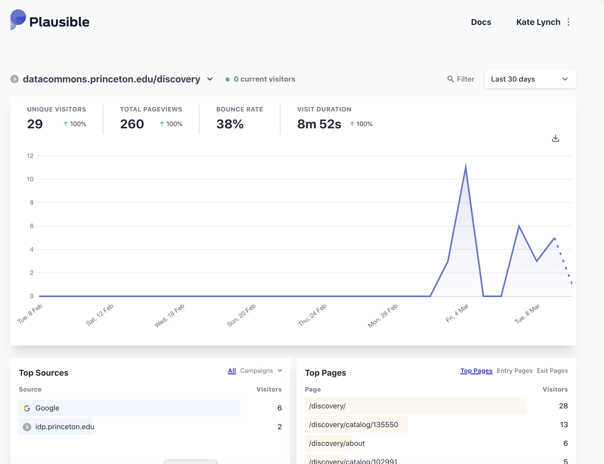
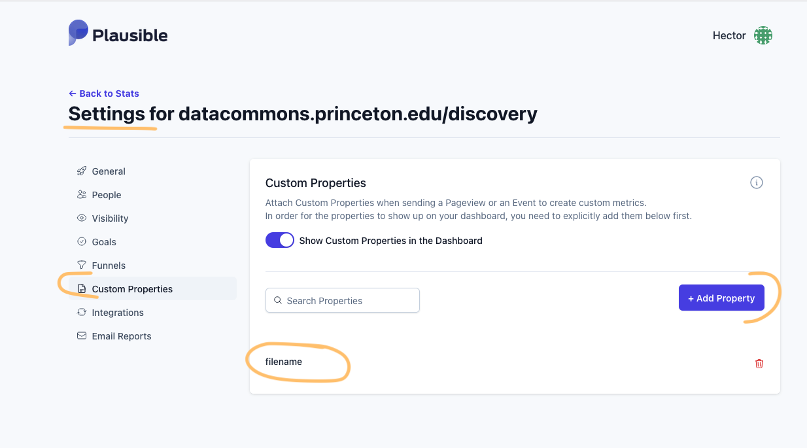
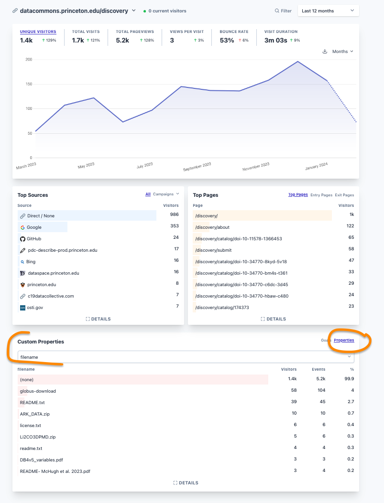

# Plausible

[Plausible.io](https://plausible.io/) is an Open Source web analytics service that is considered a privacy-friendly alternative to Google Analytics.  Users can sign up for a free Plausible account at [Plausible.io](https://plausible.io/). 

_NOTE: Emails from Plausible including site invitations and ownership transfer requests may go to the user's Junk/Spam folder._

## Adding sites

To add a new site, log into Plausible and navigate to the [homepage](https://plausible.io/), then click the "Add a new website+" button. You will be asked to supply the site domain and timezone. Once you have input these, you will receive the Javascript snippet to embed in your site to begin tracking.

## Managing the Plausible subscription

PUL has a premium subscription to Plausible through our Library IT Operations team. In order for new sites to be included in this subscription, the organization cardholder must be the site "owner" in Plausible. After creating a new site, complete the following steps to add it to the premium subscription:

- Invite the cardholder to the new site as an Admin, through the that site's "Settings / People" section. This will send them an email.

  _NOTE: Plausible emails tend to go to Junk/Spam folders. If they do not receive the email within a couple of minutes of the invitation being issued, check there._

- Once the cardholder accepts this invitation, send them a site ownership transfer from the same "Settings / Users" section of the new site in Plausible.

  _NOTE: That, too, may go to Junk._

- Once the cardholder accepts the ownership transfer, admins and viewers on that site should be able to go to the site in Plausible and see the dashboard, example below:



## Managing users and accessing the dashboard

To access sites, users must be invited by the site owner or an admin of the site as either an admin or a viewer. Admins can view the data dashboard, add more users, and adjust site settings. Viewers have read-only access to the data dashboard.

## Managing API keys

To create API keys, the Plausible site owner must:

1) Go to their [Plausible user account settings](https://plausible.io/settings) (_not_ an individual site's settings)
2) Scroll down to the "API keys" section
3) Click the "+ New API Key" button to name and create a new API key.

**_WARNING_**: The site owner must copy the API key from this screen at this step. This is the only time that the API key will be visible in Plausible!

Once the API key has been created and shared with the development team, store it in LastPass immediately.

API keys can be deleted by selecting the "Revoke" option in the "API keys" section of the Plausible user account settings page by the site owner. The site owner can create as many API keys as desired, and the keys can be used for any site for which the user is an owner in Plausible.

### Testing API keys

To verify that an API key is working for a specific site, execute the following [`curl` command](https://curl.se/docs/tutorial.html):

```bash
curl "https://plausible.io/api/v1/stats/aggregate?site_id=$SITE_ID&period=6mo&metrics=visitors,pageviews,bounce_rate,visit_duration" \
  -H "Authorization: Bearer ${TOKEN}"
```

Where `$SITE_ID` is the domain of the site in Plausible you are testing for (example: "datacommons.princeton.edu/discovery"), and `$TOKEN` is the API key for that site.

If the API key is working for that site, you should see a JSON response something like the following:

```json
{
  "results": {
    "pageviews": {
      "value": 14
    },
    "visit_duration": {
      "value": 157
    },
    "visitors": {
      "value": 1
    },
    "bounce_rate": {
      "value": 0
    }
  }
}
```

Consult the [Plausible documentation](https://plausible.io/docs) for more information on API functionality.

## Custom properties
We use custom properties to track certain activities such as download events in [PDC_Discovery](https://github.com/pulibrary/pdc_discovery).

To *define* custom properties you need to go to the Settings page for the site:



To *view the values* collected for the custom property you go to the Custom Properties in the home page and select the "Properties" option


 selected from the dropdown on the page) for story points and issues/pull requests estimated vs. completed.