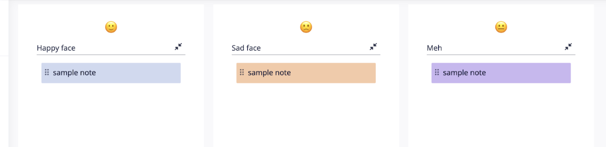

# Retrospectives

The RDSS team engages in bi-weekly retrospective meetings to reflect on sprints and team process.  We use [Retrium](https://retrium.com/) as the software for collecting and sorting cards during these meetings.  Each meeting yields one action item that the team will try out and then review at the next retrospective.  This meeting is typically scheduled for one hour, bi-weekly, on Friday afternoons as the last work activity of the week. Members of RDSS take turns facilitating.

## Format

### Example board:

- At the beginning of the meeting, the previous retrospective's action item is reviewed in brief, to determine if it happened or if there were blockers.  Further discussion of the action item may be part of the rest of the retrospective.
- Prior to the meeting, the facilitator creates the retro in Retrium, using the "Mad, Sad, Glad" format and relabels the columns to "Happy face," "Sad face," and "Meh."
- For ~5 minutes, the team anonymously adds cards into the three following columns:
  - Happy face = Good/happy things
  - Sad face = Not-good/sad things
  - Meh = Neutral/”meh” things
- There is no sorting phase for the cards, as the three categories provide the themes, and the retrospective covers all three categories.
- The facilitator picks where to start.
  - Example opening comment: "Let’s start with the 'happy' column.  I see a card that says 'we improved logging on XYZ,' who wants to talk about that?"
- The conversation goes until the five minutes are left in the meeting, at which point the one action item is decided on and (if needed) assigned to someone on the team to take the lead.
- A facilitator for next time is selected at random (optionally using the [Wheel of Names](https://wheelofnames.com/) [it's fun!]). 
- The facilitator and action item are entered into the running notes for next time.