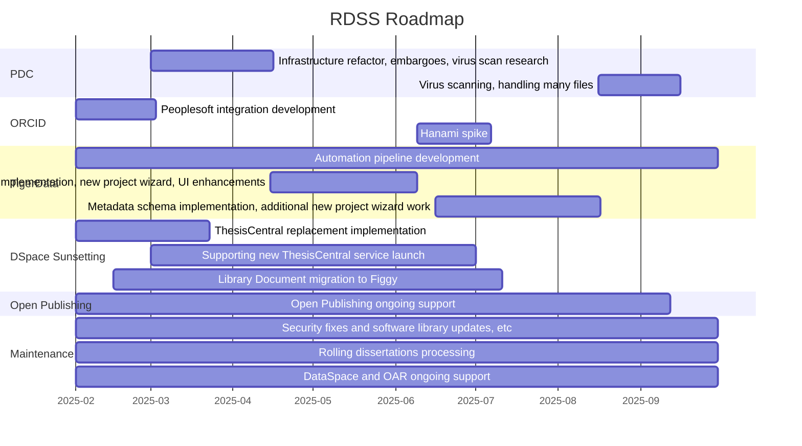

# Roadmap

Below is the current roadmap and timeline for RDSS. It is subject to change as needed, however it is written in markdown, so all history is recorded.

```mermaid
gantt
    title RDSS Roadmap
    axisFormat  %Y-%m
    dateformat YYYY-MM
    section PDC
    Infrastructure refactor, embargoes, virus scan research: pd3, 2025-03-01, 46d
    Virus scanning, handling many files: pd5, 2025-08-16, 31d
    section ORCID
    Peoplesoft integration development: or1,2025-02-01,30d
    Hanami spike: 2025-06-09, 28d
    section TigerData
    Automation pipeline development: td3,2025-02-01,241d 
    Metadata schema implementation, new project wizard, UI enhancements: td4, 2025-04-15,55d
    Metadata schema implementation, additional new project wizard work: td5, 2025-06-16,62d
    section DSpace Sunsetting
    ThesisCentral replacement implementation: dsps1,2025-02-01,50d
    Supporting new ThesisCentral service launch: dsps2,2025-03-01,122d
    Library Document migration to Figgy: dsps3,2025-02-15,146d
    section Open Publishing
    Open Publishing ongoing support: dsp3,2025-02-01,223d
    section Maintenance
    Security fixes and software library updates, etc: dsp1,2025-02-01,241d
    Rolling dissertations processing: dsp2,2025-02-01,241d
    DataSpace and OAR ongoing support: dsp3,2025-02-01,241d
```
