# Roadmap

Below is the current roadmap and timeline for RDSS, summer 2022 through January 2023. It is subject to change as needed, however it is written in markdown, so all history is recorded.

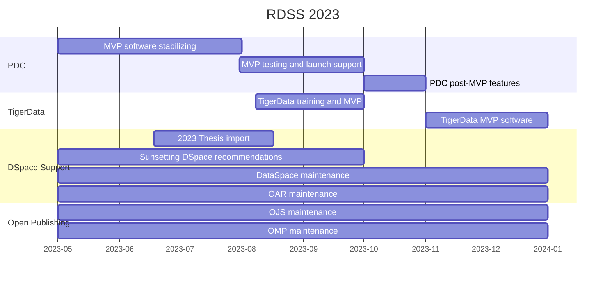

## Past Sprints

This section documents past RDSS sprints. This documentation began in late July 2022, as a result of All-Hands RDSS team discussion.

### RDSS Sprint, 2023/08/23 - 2023/09/05 1️⃣
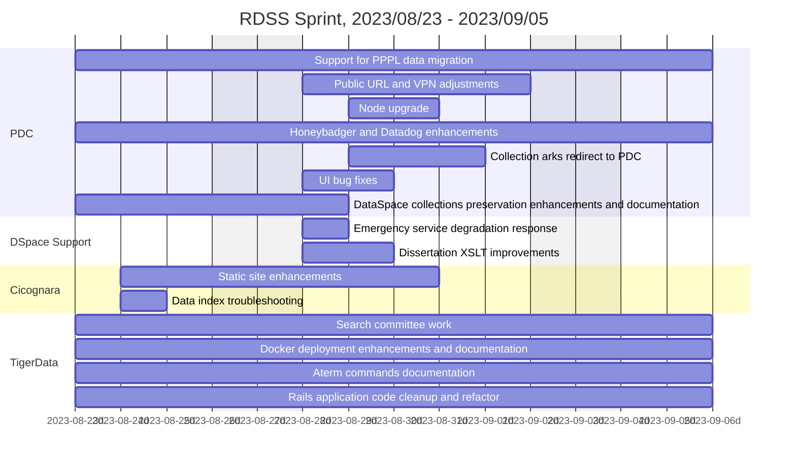

### RDSS Sprint, 2023/08/09 - 2023/08/22 🦑
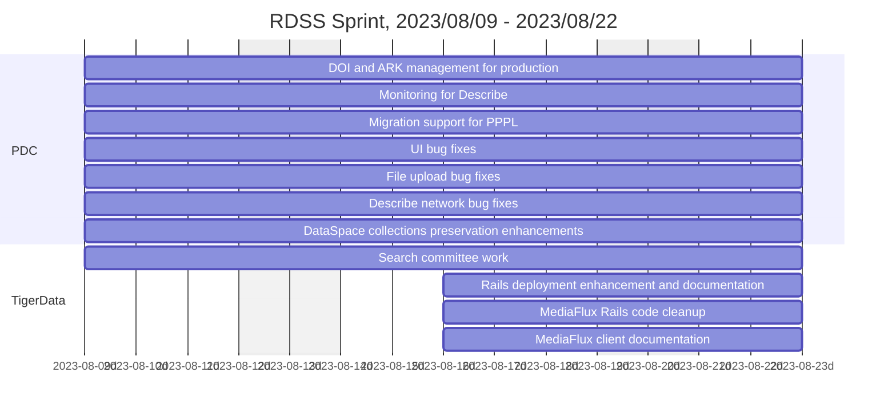

### RDSS Sprint, 2023/07/26 - 2023/08/08 🌊
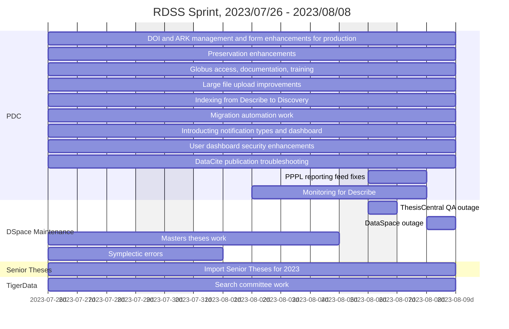

### RDSS Sprint, 2023/07/12 - 2023/07/25 🍧
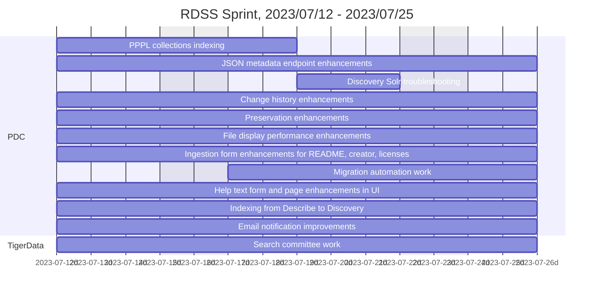

### RDSS Sprint, 2023/06/28 - 2023/07/11 🍒
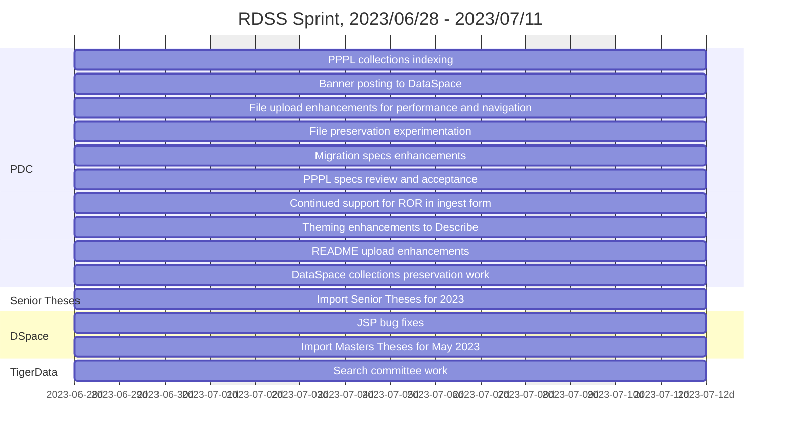

### RDSS Sprint, 2023/06/14 - 2023/06/27 ☀️
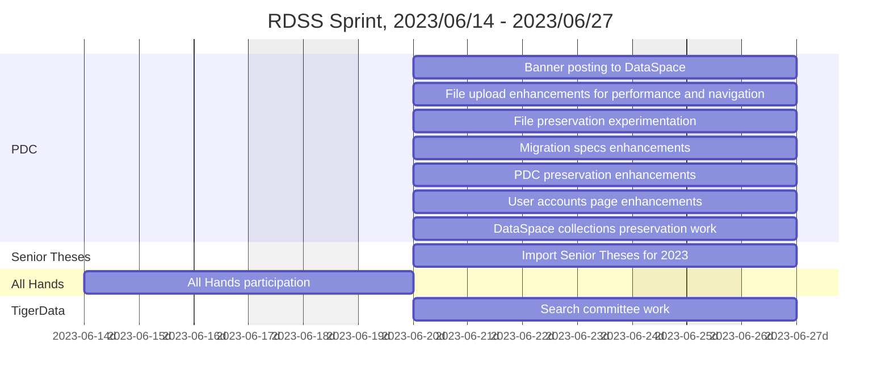

### RDSS Sprint, 2023/05/31 - 2023/06/13 🛴
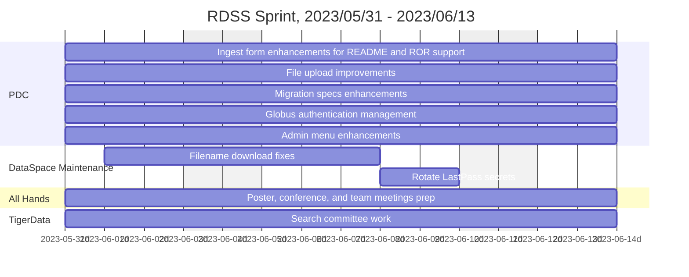

### RDSS Sprint, 2023/05/17 - 2023/05/30 🏕️
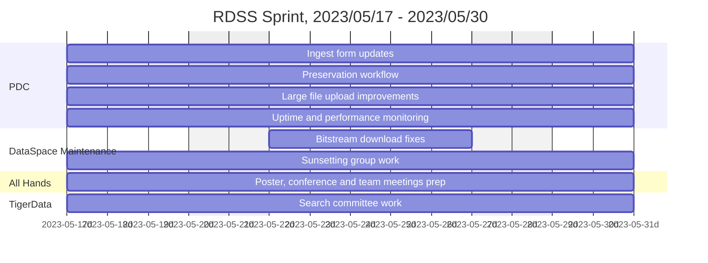


### RDSS Sprint, 2023/05/02 - 2023/05/16 🐛
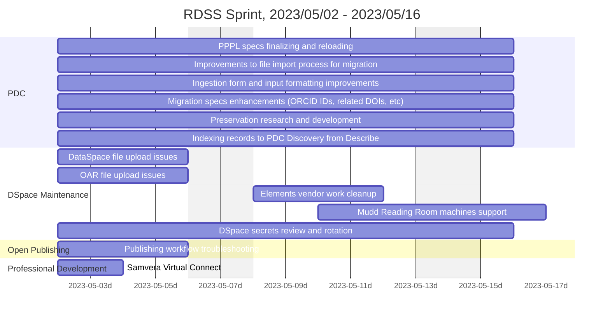

### RDSS Sprint, 2023/04/05 - 2023/04/18 🐞
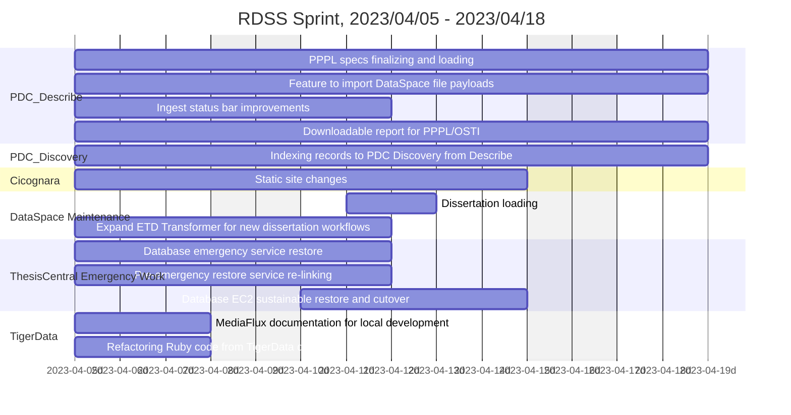

### 2023/03/22 - 2023/04/04 🕸️ 
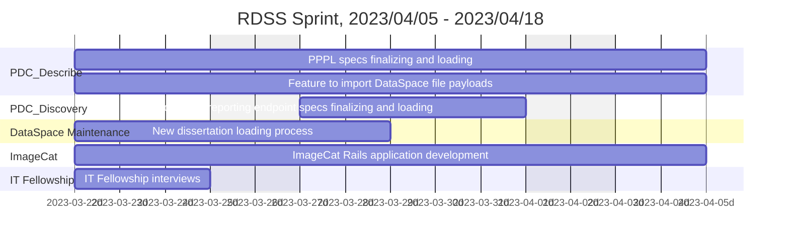

### 2023/03/08 - 2023/03/21 🕷️ 
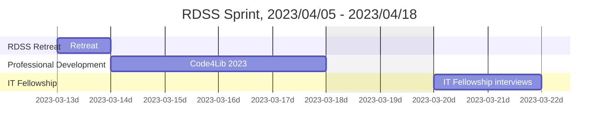

### 2023/02/22 - 2023/03/07 ☔ 
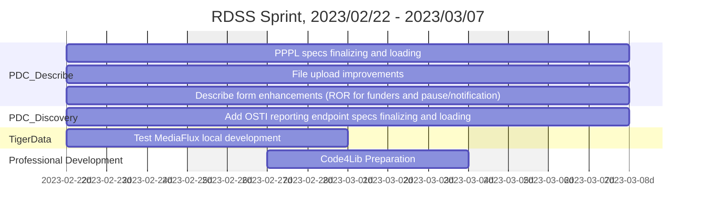

### 2023/02/08 - 2023/02/21 💝 
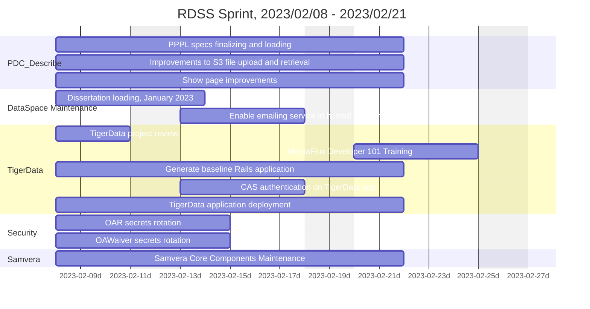

### 2023/01/25 - 2023/02/07 🎠 
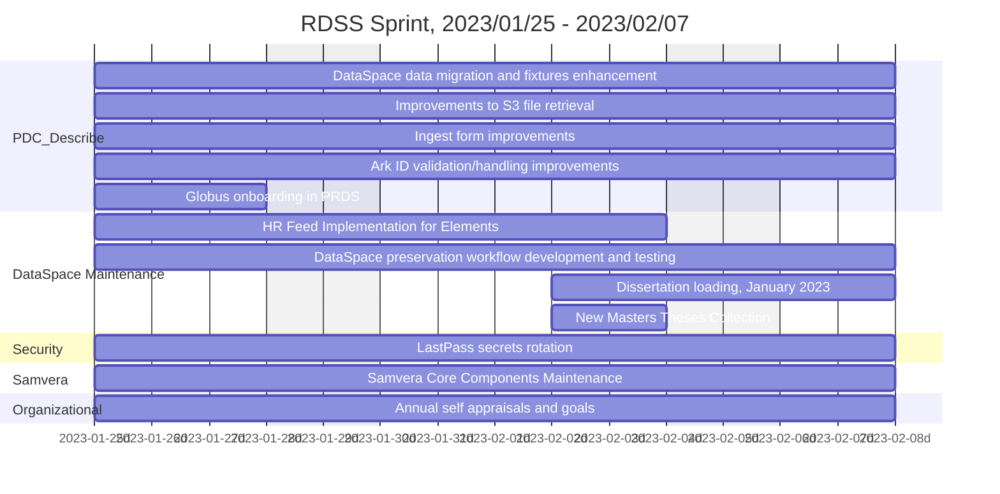

### 2023/01/11 - 2023/01/24 🕯

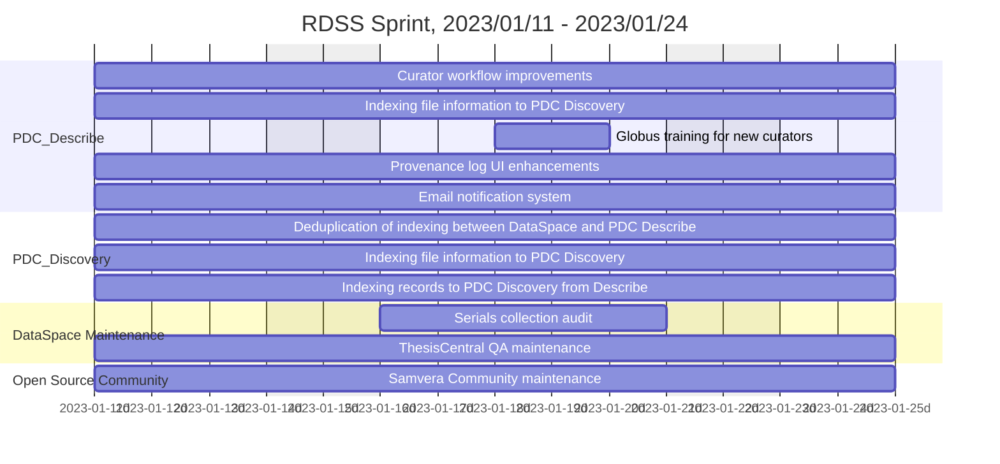

### 2022/12/28 - 2023/01/10 🧃

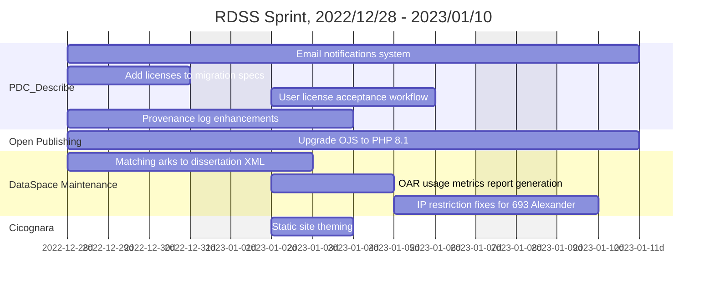

### 2022/12/14 - 2022/12/27 🍪

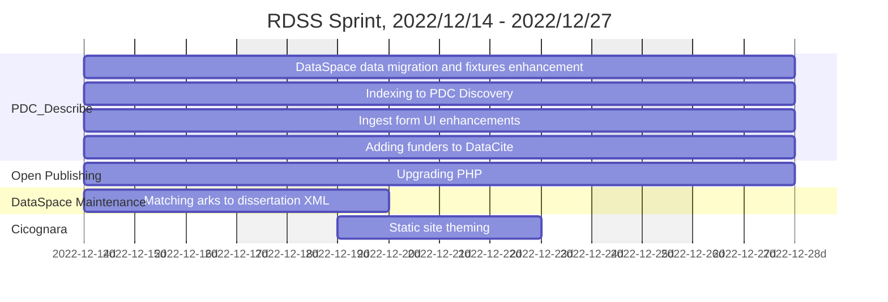

### 2022/11/30 - 2022/12/13 🎄

```mermaid
gantt
    title RDSS Sprint, 2022/11/30 - 2022/12/13
    axisFormat  %Y-%m-%dd
    dateformat YYYY-MM-DD
    excludes    weekends
    section PDC_Describe
    DataCite XML validation and fixture building: pdc1, 2022-11-30, 10d
    Production data migration preparation: pdc2, 2022-11-30, 10d
    Improvements to S3 file management: pdc3, 2022-11-30, 10d
    Ingest form improvements: pdc3, 2022-11-30, 10d
    section Open Publishing
    Upgrade OJS to PHP 8.1: ojs1, 2022-11-30, 10d
    section DataSpace Maintenance
    HR Feed Implementation for Elements: dsm1, 2022-12-07, 5d
````

### 2022/11/16 - 2022/11/29 🍠

```mermaid
gantt
    title RDSS Sprint, 2022/11/16 - 2022/11/29
    axisFormat  %Y-%m-%dd
    dateformat YYYY-MM-DD
    excludes    weekends
    section TigerData
    TigerData and MediaFlux project research: td1, 2022-11-16, 10d
    TigerData Rails application and VMs: td2, 2022-11-16, 10d
    section PDC_Describe
    Finalize DataCite fixtures: pdc1, 2022-11-16, 10d
    DataSpace data migration preparation: pdc, 2022-11-16, 10d
    section DataSpace Maintenance
    Masters Thesis Collections: dsm1, 2022-11-16, 5d
    Permissions troubleshooting and dissertation ark matching: dsm2, 2022-11-22, 3d
    Dissertation loading: dsm1, 2022-11-28, 2d
    section Cicognara
    Harvard item count troubleshooting: cic1, 2022-11-21, 4d
````


### 2022/11/02 - 2022/11/15 🌼

```mermaid
gantt
    title RDSS Sprint, 2022/11/02 - 2022/11/15
    axisFormat  %Y-%m-%dd
    dateformat YYYY-MM-DD
    excludes    weekends
    section TigerData
    MediaFlux desktop client exploration: td1, 2022-11-02, 10d
    MediaFlux aterm/Ruby exploration: td1, 2022-11-02, 10d
    TigerData and MediaFlux project research: td1, 2022-11-02, 10d
    section PDC_Describe
    Finalize DataCite fixtures: pdc1, 2022-11-02, 10d
    DataSpace data migration preparation: pdc1, 2022-11-02, 10d
    section Open Source Community
    Samvera Community maintenance: osc1, 2022-11-10, 3d
```

### 2022/10/10 - 2022/11/01 🎃

This was the beginning of a new sprint cycle framework, hence the slightly longer timeframe.

```mermaid
gantt
    title RDSS Sprint, 2022/10/10 - 2022/11/01
    axisFormat  %Y-%m-%dd
    dateformat YYYY-MM-DD
    excludes    weekends
    section PDC_Describe
    File downloads with Globus: pd1, 2022-10-10, 10d
    Email notifications: pd2, 2022-10-10, 10d
    ORCID support for contributors: pd3, 2022-10-10, 10d
    DataCite implementation and ingest form: pd4, 2022-10-10, 10d
    PPPL Migration Kick-off Planning: pd5, 2022-10-17, 5d
    section DSpace support
    Add arks to dissertations for Alma: dsm1, 2022-10-17, 5d
    Masters thesis collections support: dsm2, 2022-10-10, 3d
    Embargo troubleshooting: dsm3, 2022-10-13, 2d
    section PDC_Discovery
    Solr node repair: pdc1, 2022-10-18, 2d
    section DataSpace Sunsetting
    Elements migration wrap-up and testing: dss1, 2022-10-10,8d
```

### 2022/09/26 - 2022/10/07 🚌

```mermaid
gantt
    title RDSS Sprint, 2022/09/26 - 2022/10/07
    axisFormat  %Y-%m-%dd
    dateformat YYYY-MM-DD
    excludes    weekends
    section PDC_Describe
    File handling: pd1, 2022-09-26, 10d
    DataCite implementation and ingest form: pd2, 2022-09-26, 10d
    Improved error handling: pd3, 2022-09-26, 10d
    Indexing to PDC Discovery: pd4, 2022-09-26, 10d
    Globus trust root: pd5, 2022-09-26, 10d
    section OpenPublishing
    OJS launch prep and translation support: ojs1, 2022-09-26, 4d
    section Cicognara
    Item count troubleshooting and version support: 2022-10-03, 3d
    section DSpace support
    New collections and users: dsm1, 2022-09-26, 5d
    OAR cleanup: dsm2, 2022-10-04, 2d
    section DataSpace Sunsetting
    Elements migration: dss1, 2022-09-26, 10d
    section Open Source Community
    Blacklight Summit: osc1, 2022-10-03, 3d
```

### 2022/09/12 - 2022/09/23 🍂

```mermaid
gantt
    title RDSS Sprint, 2022/09/12 - 2022/10/23
    axisFormat  %Y-%m-%dd
    dateformat YYYY-MM-DD
    excludes    weekends
    section PDC_Describe
    Launch plan: pd1, 2022-09-12, 10d
    DataCite implementation: pd2, 2022-09-12, 10d
    Submission form improvements: pd3, 2022-09-12, 10d
    Storage workflow: pd4, 2022-09-12, 10d
    ARK and DOI handling: pd5, 2022-09-12, 10d
    Collection save and show: pd6, 2022-09-12, 10d
    section DataSpace Sunsetting
    Elements migration: dss1, 2022-09-12, 10d
```

### 2022/08/29 - 2022/09/09 🚂

```mermaid
gantt
    title RDSS Sprint, 2022/08/29 - 2022/09/09
    axisFormat  %Y-%m-%dd
    dateformat YYYY-MM-DD
    excludes    weekends
    section PDC_Describe
    File handling: pd1, 2022-08-29, 10d
    DataCite implementation and serialization: pd2, 2022-08-29, 10d
    Submission workflow: pd2, 2022-08-29, 10d
    Test suite improvements: pd2, 2022-08-29, 10d
    section DSpace support
    Mudd IP Range Fixes: dsm1, 2022-09-05, 4d
    2022 Thesis Reports for Alumni/Donor records: po2, 2022-09-05, 4d
    section DataSpace Sunsetting
    Elements migration: dss1, 2022-08-29, 10d
    section Professional Development
    Product Owner Training - September Cohort: po1, 2022-09-06, 3d
    section OpenPublishing
    Translation and theme support: ojs1, 2022-09-06, 4d
```

### 2022/08/15 - 2022/08/26 🍔

```mermaid
gantt
    title RDSS Sprint, 2022/08/15 - 2022/08/26
    axisFormat  %Y-%m-%dd
    dateformat YYYY-MM-DD
    excludes    weekends
    section 2022 Theses
    Import to DataSpace and enhance metadata: th1, 2022-08-15, 10d
    Thesis form fixes: 2022-08-15, 3d
    section DSpace Support
    IP range fixes: 2022-08-17, 4d
    section PDC_Describe
    File handling: pd1, 2022-08-15, 10d
    DataCite implementation and ingest form: pd2, 2022-08-15, 10d
    DOI handling and approval workflow: pd2, 2022-08-15, 10d
    State machine backing: pd2, 2022-08-15, 10d
    section OpenPublishing
    OJS launch prep: ojs1, 2022-08-22, 3d
    section DataSpace Sunsetting
    Elements migration: 2022-08-15, 10d
```

### 2022/08/01 - 2022/08/12 🍉

```mermaid
gantt
    title RDSS Sprint, 2022/08/01 - 2022/08/12
    axisFormat  %Y-%m-%dd
    dateformat YYYY-MM-DD
    excludes    weekends
    section 2022 Theses
    Import to DataSpace: th1, 2022-08-01, 10d
    section DSpace Support
    EZID fixes: 2022-08-11, 1d
    section Emergency Response
    Secrets leak fixes: 2022-08-10, 2d
    section PDC_Describe
    File uploading: pd1, 2022-08-01, 5d
    DataCite implementation and ingest form: pd2, 2022-08-01, 10d
    Globus staging and production deployment: 2022-08-01, 10d
    section OpenPublishing
    OJS launch prep: ojs1, 2022-08-01, 5d
    section DataSpace Sunsetting
    Elements migration: 2022-08-01, 10d
```

### 2022/07/18 - 2022/07/29 🫐

```mermaid
gantt
    title RDSS Sprint, 2022/07/18 - 2022/07/29
    axisFormat  %Y-%m-%dd
    dateformat YYYY-MM-DD
    excludes    weekends
    section All-Hands
    ITIMS All-Hands Week: ah1, 2022-07-18, 5d
    section 2022 Theses
    Import to DataSpace: th1, 2022-07-25, 5d
    section PDC_Describe
    File uploading: pd1, 2022-07-25, 5d
    DataCite: pd2, 2022-07-25, 5d
    Globus staging deployment: 2022-07-25, 5d
    section DataSpace Sunsetting
    Elements migration: 2022-07-18, 10d
```
