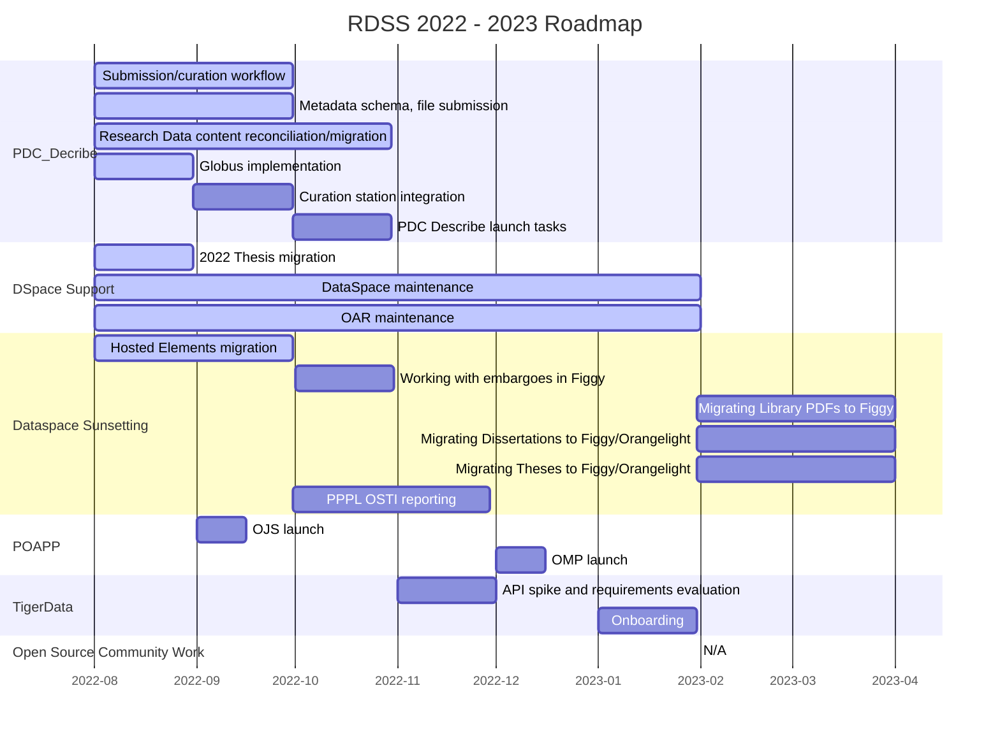
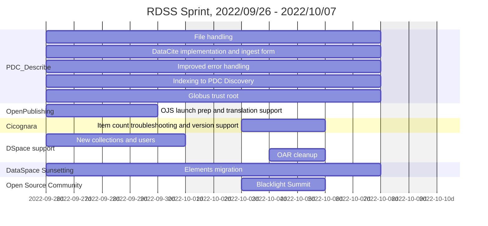
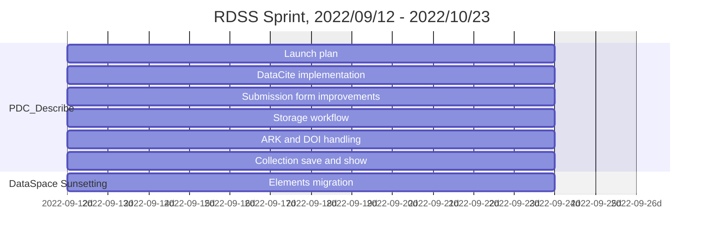
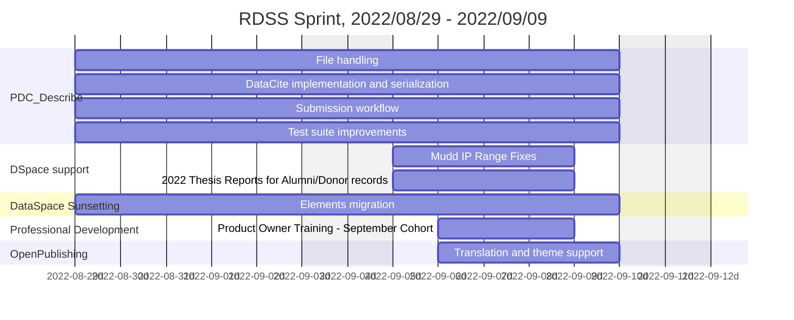
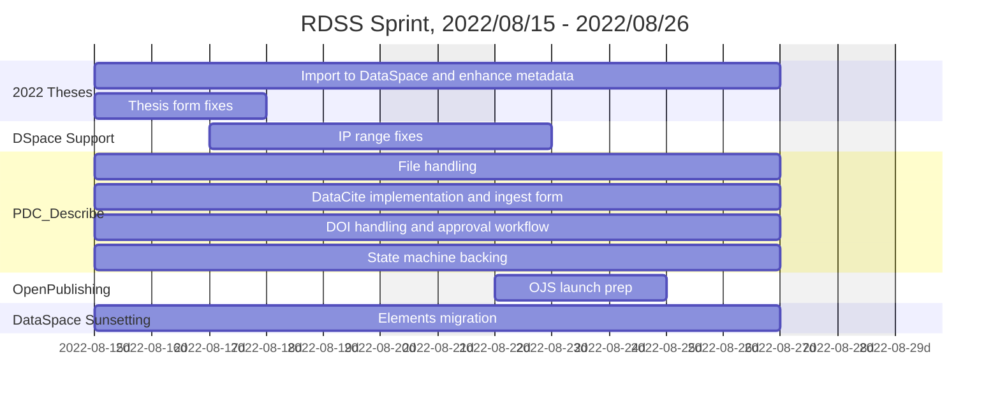
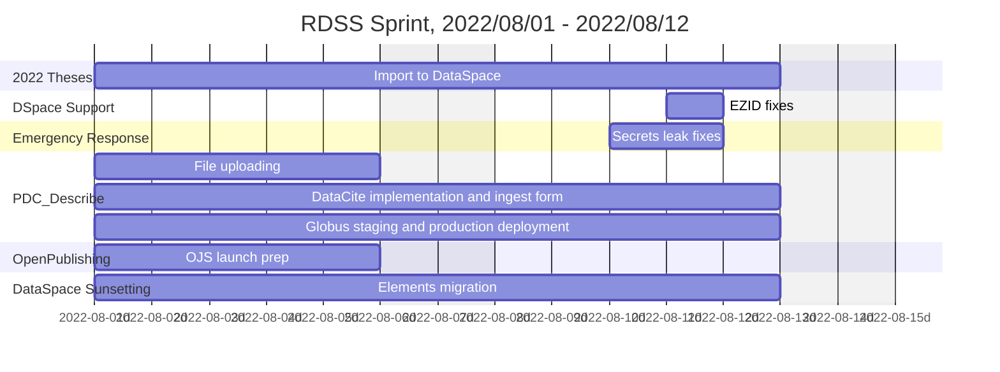

# Roadmap

Below is the current roadmap and timeline for RDSS, summer 2022 through January 2023.  It is subject to change as needed, however it is written in markdown, so all history is recorded.



## Past Sprints

This section documents past RDSS sprints.  This documentation began in late July 2022, as a result of All-Hands RDSS team discussion.

### 2022/11/02 - 2022/11/15 🌼

```mermaid
gantt
    title RDSS Sprint, 2022/11/02 - 2022/11/15
    axisFormat  %Y-%m-%dd
    dateformat YYYY-MM-DD
    excludes    weekends
    section TigerData
    MediaFlux desktop client exploration: td1, 2022-11-02, 10d
    MediaFlux aterm/Ruby exploration: td1, 2022-11-02, 10d
    TigerData and MediaFlux project research: td1, 2022-11-02, 10d
    section PDC_Describe
    Finalize DataCite fixtures: pdc1, 2022-11-02, 10d
    DataSpace data migration preparation: pdc1, 2022-11-02, 10d
    section Open Source Community
    Samvera Community maintenance: osc1, 2022-11-10, 3d
````

### 2022/10/10 - 2022/11/01 🎃

This was the beginning of a new sprint cycle framework, hence the slightly longer timeframe.

```mermaid
gantt
    title RDSS Sprint, 2022/10/10 - 2022/11/01
    axisFormat  %Y-%m-%dd
    dateformat YYYY-MM-DD
    excludes    weekends
    section PDC_Describe
    File downloads with Globus: pd1, 2022-10-10, 10d
    Email notifications: pd2, 2022-10-10, 10d
    ORCID support for contributors: pd3, 2022-10-10, 10d
    DataCite implementation and ingest form: pd4, 2022-10-10, 10d
    PPPL Migration Kick-off Planning: pd5, 2022-10-17, 5d
    section DSpace support
    Add arks to dissertations for Alma: dsm1, 2022-10-17, 5d
    Masters thesis collections support: dsm2, 2022-10-10, 3d
    Embargo troubleshooting: dsm3, 2022-10-13, 2d
    section PDC_Discovery
    Solr node repair: pdc1, 2022-10-18, 2d
    section DataSpace Sunsetting
    Elements migration wrap-up and testing: dss1, 2022-10-10,8d
```

### 2022/09/26 - 2022/10/07 🚌



### 2022/09/12 - 2022/09/23 🍂



### 2022/08/29 - 2022/09/09 🚂



### 2022/08/15 - 2022/08/26 🍔




### 2022/08/01 - 2022/08/12 🍉



### 2022/07/18 - 2022/07/29 🫐


