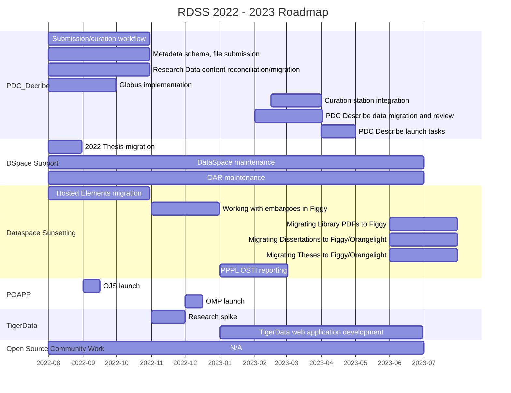
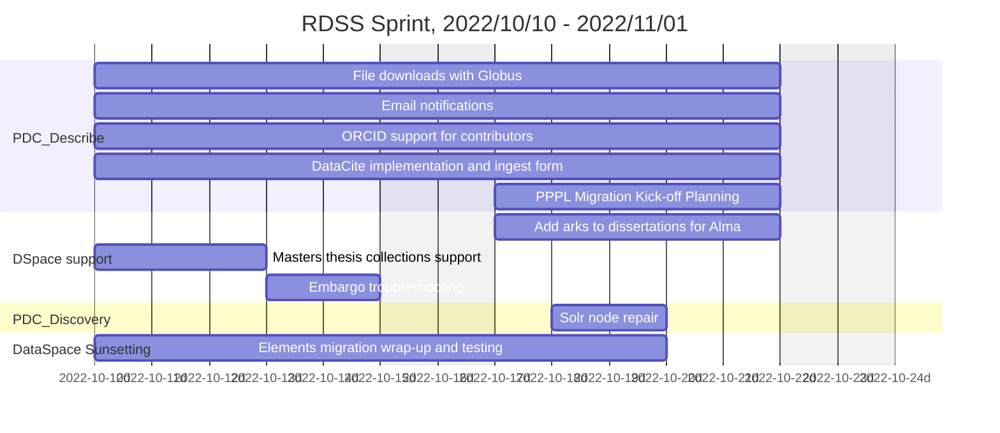

# Roadmap

Below is the current roadmap and timeline for RDSS, summer 2022 through January 2023. It is subject to change as needed, however it is written in markdown, so all history is recorded.



## Past Sprints

This section documents past RDSS sprints. This documentation began in late July 2022, as a result of All-Hands RDSS team discussion.

### 2023/01/25 - 2023/02/07 🎠 

### 2023/01/11 - 2023/01/24 🕯

### 2022/12/28 - 2023/01/10 🧃


### 2022/12/14 - 2022/12/27 🍪

### 2022/11/30 - 2022/12/13 🎄

```mermaid
gantt
    title RDSS Sprint, 2022/11/30 - 2022/12/13
    axisFormat  %Y-%m-%dd
    dateformat YYYY-MM-DD
    excludes    weekends
    section PDC_Describe
    DataCite XML validation and fixture building: pdc1, 2022-11-30, 10d
    Production data migration preparation: pdc2, 2022-11-30, 10d
    Improvements to S3 file management: pdc3, 2022-11-30, 10d
    Ingest form improvements: pdc3, 2022-11-30, 10d
    section Open Publishing
    Upgrade OJS to PHP 8.1: ojs1, 2022-11-30, 10d
    section DataSpace Maintenance
    HR Feed Implementation for Elements: dsm1, 2022-12-07, 5d
````

### 2022/11/16 - 2022/11/29 🍠

```mermaid
gantt
    title RDSS Sprint, 2022/11/16 - 2022/11/29
    axisFormat  %Y-%m-%dd
    dateformat YYYY-MM-DD
    excludes    weekends
    section TigerData
    TigerData and MediaFlux project research: td1, 2022-11-16, 10d
    TigerData Rails application and VMs: td2, 2022-11-16, 10d
    section PDC_Describe
    Finalize DataCite fixtures: pdc1, 2022-11-16, 10d
    DataSpace data migration preparation: pdc 2022-11-16, 10d
    section DataSpace Maintenance
    Masters Thesis Collections: dsm1, 2022-11-16, 5d
    Permissions troubleshooting and dissertation ark matching: dsm2, 2022-11-22, 3d
    Dissertation loading: dsm1, 2022-11-28, 2d
    section Cicognara
    Harvard item count troubleshooting: cic1, 2022-11-21, 4d
````


### 2022/11/02 - 2022/11/15 🌼

```mermaid
gantt
    title RDSS Sprint, 2022/11/02 - 2022/11/15
    axisFormat  %Y-%m-%dd
    dateformat YYYY-MM-DD
    excludes    weekends
    section TigerData
    MediaFlux desktop client exploration: td1, 2022-11-02, 10d
    MediaFlux aterm/Ruby exploration: td1, 2022-11-02, 10d
    TigerData and MediaFlux project research: td1, 2022-11-02, 10d
    section PDC_Describe
    Finalize DataCite fixtures: pdc1, 2022-11-02, 10d
    DataSpace data migration preparation: pdc1, 2022-11-02, 10d
    section Open Source Community
    Samvera Community maintenance: osc1, 2022-11-10, 3d
```

### 2022/10/10 - 2022/11/01 🎃

This was the beginning of a new sprint cycle framework, hence the slightly longer timeframe.



### 2022/09/26 - 2022/10/07 🚌


### 2022/09/12 - 2022/09/23 🍂


### 2022/08/29 - 2022/09/09 🚂


### 2022/08/15 - 2022/08/26 🍔


### 2022/08/01 - 2022/08/12 🍉


### 2022/07/18 - 2022/07/29 🫐


