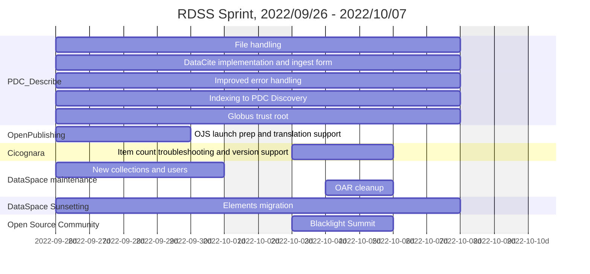

# Roadmap

Below is the current roadmap and timeline for RDSS, summer 2022 through January 2023.  It is subject to change as needed, however it is written in markdown, so all history is recorded.

## Past Sprints

This section documents past RDSS sprints.  This documentation began in late July 2022, as a result of All-Hands RDSS team discussion.

### 2022/09/26 - 2022/10/07

### 2022/09/12 - 2022/09/23

### 2022/08/29 - 2022/09/09

### 2022/08/15 - 2022/08/26

### 2022/08/01 - 2022/08/12

### 2022/07/18 - 2022/07/29

