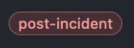
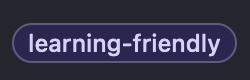
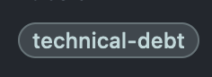
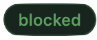
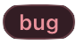
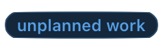
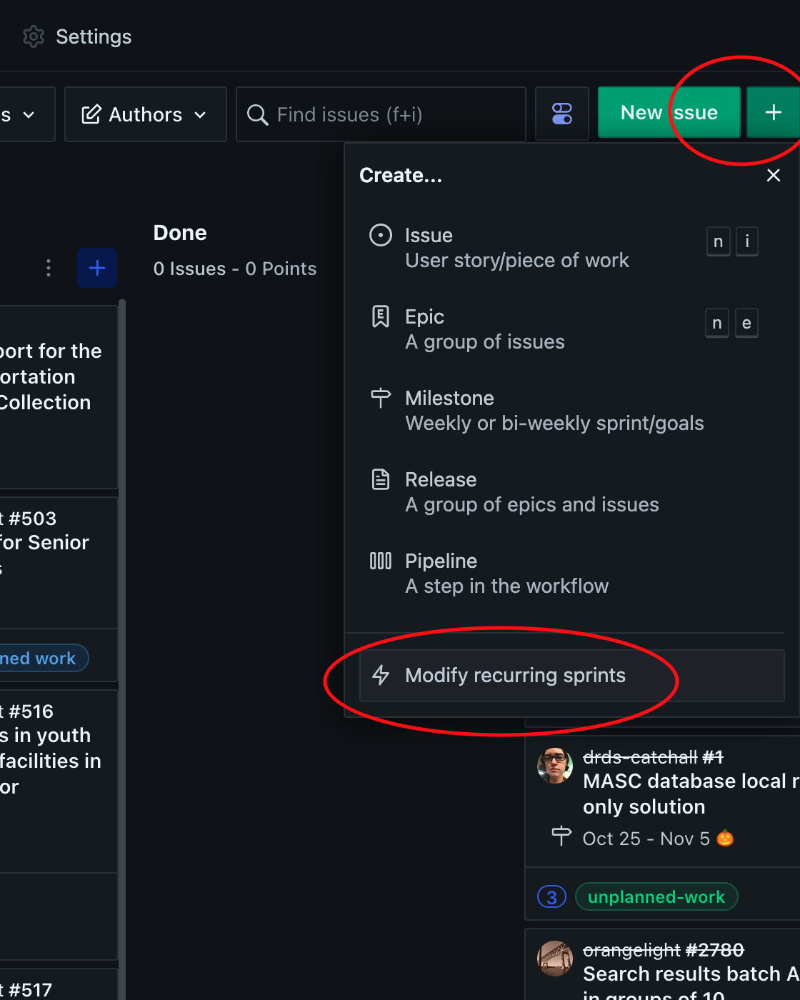

# Sprints

The RDSS team's work is structured in 2-week sprints. These sprints begin with a sprint planning meeting, and end with a sprint wrap-up. See [Meetings](meetings.md) for information on how these meetings run.  We also have a bi-weekly retrospective meeting, see [Retrospectives](retros.md) for information on these.

## Norms

- The team uses a ZenHub board called [RDSS Sprint](https://app.zenhub.com/workspaces/rdss-61a4f1a12a399b001730f65a/board) to track our work.
- Sprints are delineated by [ZenHub Sprints](https://help.zenhub.com/support/solutions/articles/43000611544-an-introduction-to-zenhub-sprints), which include the date range of the work cycle and an emoji icon to help quickly identify separate sprints.[1]
- GitHub Issues are used to track tasks and incidents which are prioritized for any given sprint. Please reference [the standards for creating and updating Issues](issues.md) for further information.
- Any issue in a given sprint must have a GitHub estimate before it is worked on. This helps us estimate how much work we'll be able to accomplish in a given sprint, which helps us give our stakeholders more predictability around when work will be delivered.

## Sprint Meetings

### Sprint Planning

1. Look at how many story points we accomplished in the last sprint, and estimate how many story points we think we can accomplish in this one. We might adjust the number of story points in a sprint because someone on the team is on vacation, or because there are competing team priorities (e.g., a week with a conference or lots of meetings).
2. Check for any tickets with the [`post-incident` label](https://github.com/pulibrary/rdss-catchall/issues/108#workspaces/rdss-61a4f1a12a399b001730f65a/board?labels=post-incident) in RDSS repositories.  Make sure that these tickets are all reasonably accounted for in a sprint, either the one being planned or another near-term sprint as appropriate.
3. Revisit the notes from any post-incident meetings that occured since the last sprint to ensure that all intended tickets were created.  Create, label, and triage any additional `post-incident` tickets.
4. Add candidate tickets to the sprint.
5. Ensure all candidate tickets are estimated.
6. Decide as a team which tickets are highest priority. By the end of the meeting we should have a sprint board containing about two weeks worth of work, in about the right priority order.
7. Pick an emoji for this sprint.
8. Pick a [runner](runner.md) for this sprint.

### During the Sprint

1. Any new tickets that must be added to the board during the sprint (e.g., for production emergencies) gets a label of `unplanned work`. [Our goal is to keep unplanned work to a minimum.](https://www.pagerduty.com/blog/5-ways-unplanned-work-disrupting-business/)
2. The mid-sprint planning meeting is a chance to check our progress and reflect. Are we on track to finish what we thought we'd finish? Or do we need to adjust expectations?

### Sprint Wrap-up

1. We close out any tickets that can be closed. If any tickets are still open, we decide whether to move them to the next sprint.
2. We record how many story points we completed in this sprint and how many of them were unplanned work.
3. We close the sprint and get ready to start the next one.

## Labels
We use the [rdss-github-labeler](https://github.com/pulibrary/rdss-github-labeler) to ensure that all our projects have (at least somewhat) consistent labels. 
We use labels to help with prioritization and process improvement.

Some important ones are:

When we have an outage or significant degradation of service, that's an "incident." In the aftermath of an incident, we want to identify ways we could prevent this problem in the future, and the tickets that emerge from that conversation should get a `post-incident` label. We should review and prioritize these regularly. 

We want to support our early career colleagues by giving them a steady stream of small, well defined tickets that they can work. If a ticket seems like a good candidate for our early career fellows or someone in their first two years of professional software development, give it this label to make it easy for early career folks to find tickets they can work.

We want to stay on top of our [technical debt](https://en.wikipedia.org/wiki/Technical_debt), so we can pay it down regularly. Technical debt might mean going back to re-work places where we took a shortcut, or it might mean upgrading systems that have had deferred maintenance.  

We strive to prioritize accessibility in all of the work we produce. When we plan for accessibility early in the design process we are more likely to produce software that can be used by a broader range of people.

When work is blocked on a ticket in a way that it out of our hands, we assign a `blocked` label. When a ticket is blocked it's important to clearly state what the blocker is so we can tell when it has become unblocked. Assigning a `blocked` label should make it more visible that we have work we can't deliver.

A bug is a defect in code that has already been delivered to a customer. A bug label is appropriate when the software is described as working in a certain way, but in reality it does not work in that way. We track bugs because it gives us a sense of how often we are delivering software that does not work as advertised. Generally speaking, bugs should be prioritized above new feature development, because the longer we wait to fix a bug the more expensive it will be to fix, and letting bugs exist for a long time erodes our stakeholders' trust in our work.

Any ticket that was not on the board at the start of the sprint that has to be added later counts as unplanned work. Tracking unplanned work is a DevOps best practice: The more unplanned work, the less time exists to create and deliver intentionally prioritized work. Bringing visibility to and measuring unplanned work helps to reduce risk and improve performance.

We sometimes assign project- or feature-specific labels to make it easier to group issues. These are somewhat ad hoc, and can be created on an as-needed basis.

## Notes

### Emojis

[1] New sprints are created automatically, but we like to customize them to add an emoji. This makes it easier to talk about our work and recognize relevant issues on the board. To add an emoji to the auto-created sprint, click on the green plus sign at the top right of the Zen Hub board, and go to the "Modify recurring sprints" menu item. From there you can rename a sprint, including adding an emoji.

### Changing sprint schedules

If we need to change the schedule of our sprints we can also do that under the green plus sign at the top right of the Zen Hub board. Click the plus sign, then click "Modify Recurring Sprints", then choose "Change Sprint Schedule." Select when you want the next sprint to begin and when it should end. Make sure you hit the "Save" button at the bottom left of the sprint list. Note that doing this will cause all the tickets in your current sprint to move to the new sprint, which might leave you with a gap in your sprint schedule.
