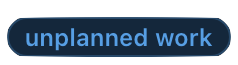
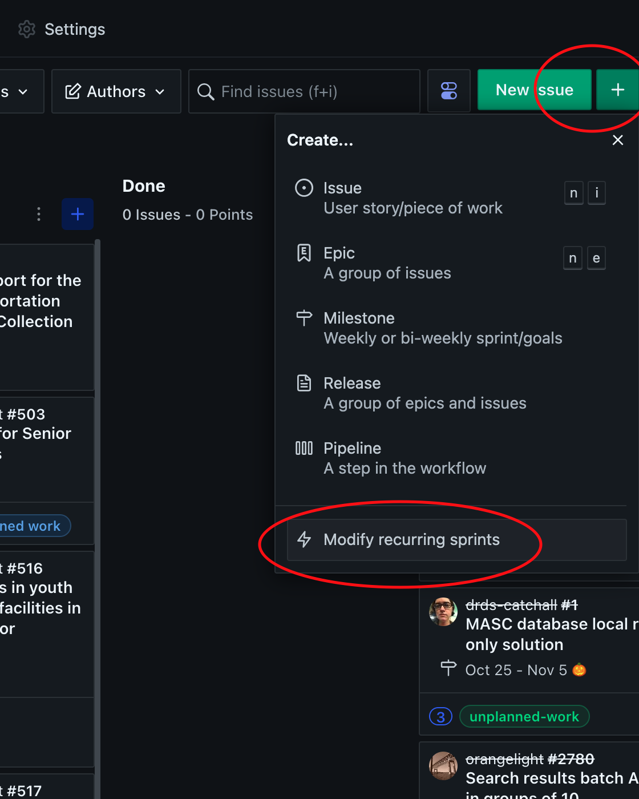

# Work Cycles

The RDSS team's work is structured in 2-week cycles.  These cycles begin with a cycle planning meeting, and end with a cycle wrap-up and retrospective.  See [Meetings](meetings.md) for information on how these meetings run.

## Norms

* The team uses a ZenHub board called [RDSS Work Cycle](https://app.zenhub.com/workspaces/rdss-workcycles-61a4f1a12a399b001730f65a/board) to track our work.  
* Cycles are delineated by [ZenHub Sprints](https://help.zenhub.com/support/solutions/articles/43000611544-an-introduction-to-zenhub-sprints), which include the date range of the work cycle and an emoji icon to help quickly identify separate work cycles.[1]
* Any issue in a given work cycle must have a GitHub estimate before it is worked on. This helps us estimate how much work we'll be able to accomplish in a given work cycle, which helps us give our stakeholders more predictability around when work will be delivered.

## Work Cycle Meetings

### Work Cycle Planning
1. Look at how many story points we accomplished in the last work cycle, and estimate how many story points we think we can accomplish in this one. We might adjust the number of story points in a sprint because someone on the team is on vacation, or because there are competing team priorities (e.g., a week with a conference or lots of meetings).
2. Add candidate tickets to the sprint.
3. Ensure all candidate tickets are estimated.
4. Decide as a team which tickets are highest priority. By the end of the meeting we should have a sprint board containing about two weeks worth of work, in about the right priority order.
5. Pick an emoji for our four-weeks-out sprint.

### During the Work Cycle
1. Any new tickets that must be added to the board during the work cycle (e.g., for production emergencies) gets a label of `unplanned work`. [Our goal is to keep unplanned work to a minimum.](https://www.pagerduty.com/blog/5-ways-unplanned-work-disrupting-business/)
2. The mid-workcycle planning meeting is a chance to check our progress and reflect.  Are we on track to finish what we thought we'd finish? Or do we need to adjust expectations?

### Work Cycle Wrap-up and Retro
1. We close out any tickets that can be closed. If any tickets are still open, we decide whether to move them to the next sprint.
2. We record how many story points we completed in this work cycle and how many of them were unplanned work.
3. We close the sprint and get ready to start the next one.
4. We have a retrospective about the work cycle and we pick one thing that we want to do to improve our process next time.

## Labels
We use labels to help with prioritization and process improvement.

  We strive to prioritize accessibility in all of the work we produce. When we plan for accessibility early in the design process we are more likely to produce software that can be used by a broader range of people.

  When work is blocked on a ticket in a way that it out of our hands, we assign a `blocked` label. When a ticket is blocked it's important to clearly state what the blocker is so we can tell when it has become unblocked. Assigning a `blocked` label should make it more visible that we have work we can't deliver.

  A bug is a defect in code that has already been delivered to a customer. A bug label is appropriate when the software is described as working in a certain way, but in reality it does not work in that way. We track bugs because it gives us a sense of how often we are delivering software that does not work as advertised. Generally speaking, bugs should be prioritized above new feature development, because the longer we wait to fix a bug the more expensive it will be to fix, and letting bugs exist for a long time erodes our stakeholders' trust in our work.

  When we add a ticket to a sprint, but then have to remove it, we add the deferred label. This should let us make it visible when we are trying to get to a task but are unable to prioritize it, perhaps because of unplanned work or incomplete knowledge about how to implement it.

  Any ticket that was not on the board at the start of the work cycle that has to be added later counts as unplanned work.  Tracking unplanned work is a DevOps best practice: The more unplanned work, the less time exists to create and deliver intentionally prioritized work. Bringing visibility to and measuring unplanned work helps to reduce risk and improve performance.

  
  
  

  We sometimes assign project- or feature-specific labels to make it easier to group issues. These are somewhat ad hoc, and can be created on an as-needed basis.

## Notes

### Emojis
[1] New sprints are created automatically, but we like to customize them to add an emoji. This makes it easier to talk about our work and recognize relevant issues on the board. To add an emoji to the auto-created sprint, click on the green plus sign at the top right of the Zen Hub board, and go to the "Modify recurring sprints" menu item. From there you can rename a sprint, including adding an emoji.

### Changing sprint schedules
If we need to change the schedule of our sprints we can also do that under the green plus sign at the top right of the Zen Hub board. Click the plus sign, then click "Modify Recurring Sprints", then choose "Change Sprint Schedule." Select when you want the next sprint to begin and when it should end. Make sure you hit the "Save" button at the bottom left of the sprint list.  
